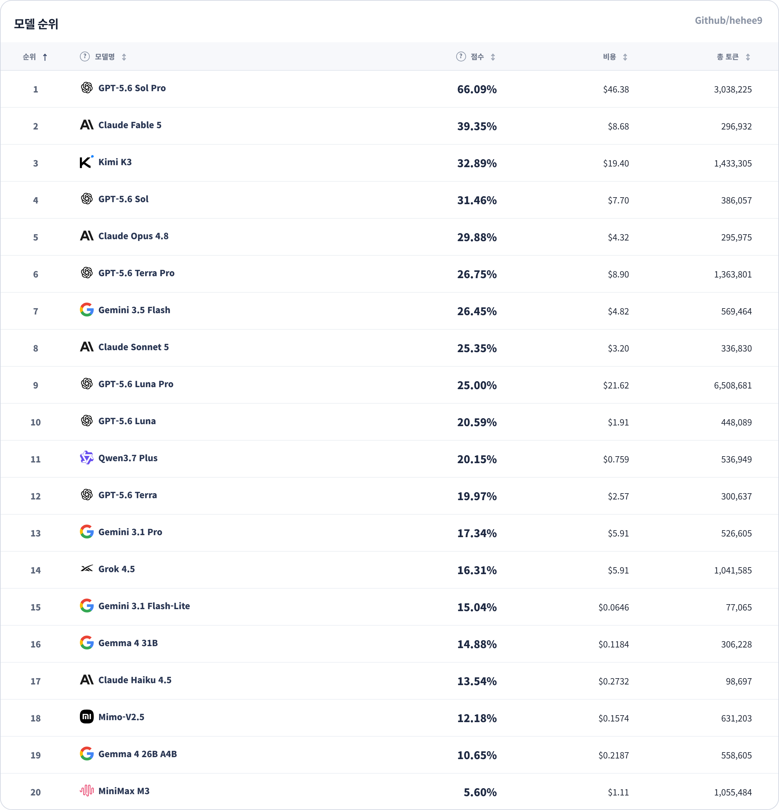
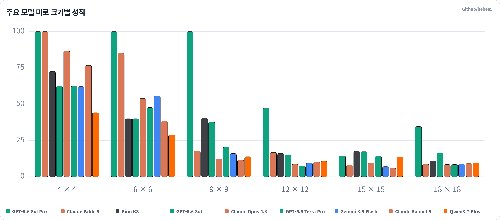
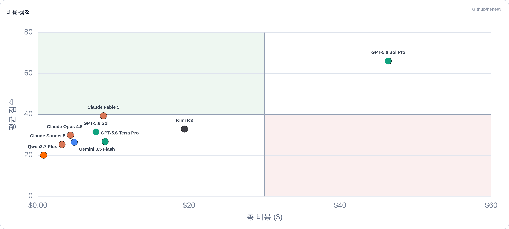
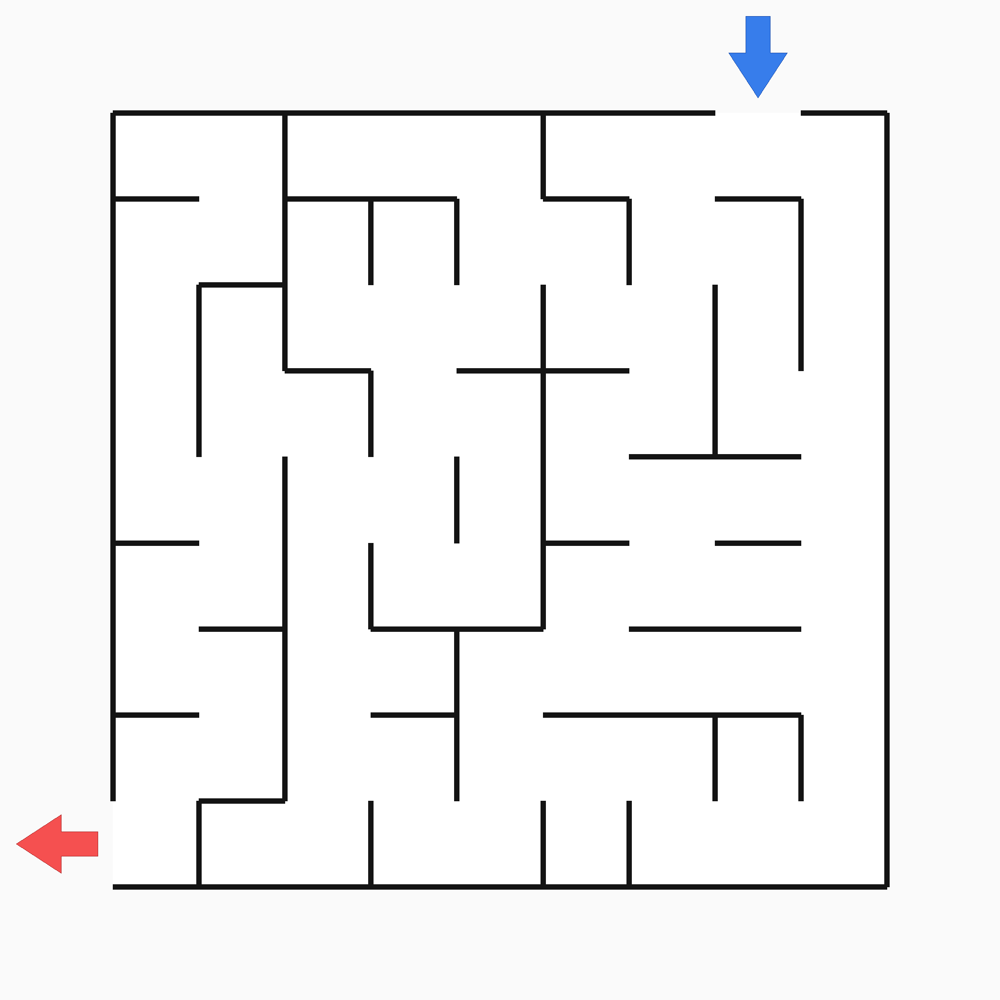
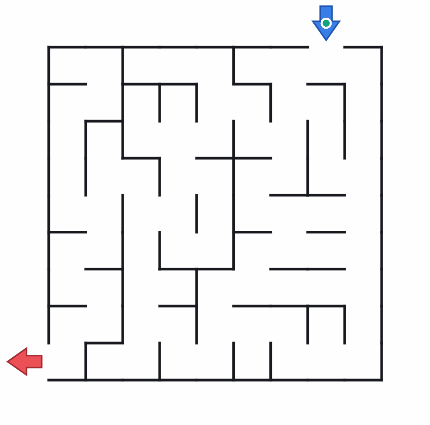

# Maze Bench

**한국어 문서: [README_ko.md](./README_ko.md)**

[](LICENSE)
[](https://www.python.org/downloads/)
[](https://ko-fi.com/hehee9)

<div align="center">

### [**Interactive Dashboard**](https://hehee9.github.io/maze-bench/public/leaderboard.html)

[](https://hehee9.github.io/maze-bench/public/leaderboard.html)

**View the leaderboard, compare model performance, and watch replays on the dashboard above.**

</div>

---

## Overview

Maze Bench evaluates whether a model can inspect a rectangular maze image and produce an escape route. It is designed to measure continuous visual and spatial reasoning. The benchmark generates rectangular maze images and their solutions at random, then scores each model's movement log by multiplying completion by efficiency.

The benchmark contains five mazes for each of six sizes: easy (4x4 and 6x6), medium (9x9 and 12x12), and hard (15x15 and 18x18). **Even Claude Fable 5 scores below 40% overall.** Reasoning was limited to `medium` due to cost, so stronger reasoning settings may improve the results.

---

## Benchmark Results

### Leaderboard



Claude Fable 5 leads the overall ranking by a wide margin. Kimi K3 and GPT-5.6 Sol follow, while Gemini 3.5 Flash also delivers a solid result.

The ranking changes when the results are split by difficulty.

**Easy**

| Rank | Model | Score |
| --- | --- | --- |
| 1 | **Claude Fable 5** | 92.54% |
| 2 | **Claude Opus 4.8** | 70.29% |
| 3 | **Gemini 3.5 Flash** | 58.80% |
| 5 | **Kimi K3** | 56.24% |
| 7 | **GPT-5.6 Sol** | 51.24% |

**Hard**

| Rank | Model | Score |
| --- | --- | --- |
| 1 | **GPT-5.6 Sol** | 16.81% |
| 2 | **Kimi K3** | 14.27% |
| 3 | **Qwen3.7 Plus** | 11.68% |
| 6 | **GPT-5.6 Terra** | 10.40% |
| 8 | **Claude Opus 4.8** | 8.93% |
| 9 | **Claude Fable 5** | 8.34% |

Claude Fable and Opus perform much better on **small mazes** and rise to the top of the ranking. GPT and Kimi perform relatively better on **large mazes**, changing the order of the leading models.



The chart makes this pattern easier to see.



When cost efficiency is included, Claude models generally perform best on Maze Bench. GPT and Kimi achieve high scores but are relatively less cost-efficient.

---

## Benchmark Design

### Task Format

Each task presents a randomly generated maze image and asks the model to return a single line of movement commands that follows the required output format.



The model must choose a direction at every intersection, corner, and dead end. It can move forward (`S`), backward (`B`), right (`R`), or left (`L`). All directions are relative to the direction the player is currently facing. The agent automatically continues through uninterrupted straight corridors, and movement stops immediately if it hits a wall.

The model must return a single-line string such as `S R L S R R L L ...`, which is then scored. Wrapping the output in a code block is also allowed.

The instruction prompt is available [here](./scripts/prompt.md).

### Scoring

Each maze is scored as `100 × P × E`.

- `P`: progress score (`m/(m+r)`)
- `E`: efficiency score (`D/(m+r)`)
- `D`: minimum number of moves from the start to the goal
- `m`: number of successful moves completed without hitting a wall
- `r`: minimum number of moves from the final position to the goal

The score is calculated from the model's final position. A movement path may therefore pass through a position that would have received a higher score before ending elsewhere.

The overall score is the average of all individual maze scores.

### Visualization and Replay



Maze-solving replays are available directly on the [dashboard](https://hehee9.github.io/maze-bench/public/index.html).

The replay viewer supports optimal-path overlays and synchronized playback of multiple models.

---

## Try It Yourself

### Installation

Python 3.10 or later is required. Install the dependencies with:

```bash
python -m pip install -r requirements.txt
```

### Quick Start

Generate five `15 × 15` mazes:

```bash
python scripts/maze_benchmark.py generate --width 15 --height 15 --wall-density 0.8 --image-size 2048 --count 5 --out-dir maze_out --prefix maze
```

The generator creates different mazes on every run, even with the same options, and records the seeds used in the results.

Score a model's commands on one maze:

```bash
python scripts/maze_benchmark.py score --problem-json maze_out/maze_001.json --log "S R S L B S"
```

Use `--log-file model_output.txt` to read the output from a file.

Validate the integrity of a generated problem JSON:

```bash
python scripts/maze_benchmark.py validate --problem-json maze_out/maze_001.json
```

To score an entire problem set, prepare a JSON file that maps problem IDs to model outputs:

```json
{
  "maze_001": "S R S L B S",
  "maze_002": "S L R S S L"
}
```

```bash
python scripts/maze_benchmark.py score-set --manifest maze_out/maze_manifest.json --logs-json model_outputs.json --output scores.json
```

### Generation Options and Output Files

| Option | Description | Default |
|---|---|---:|
| `--width` | Number of columns | Required |
| `--height` | Number of rows | Required |
| `--wall-density` | A value from 0 to 1 that controls how walls and passages are generated | `0.7` |
| `--image-size` | Side length of the square image | `2048` |
| `--count` | Number of problems to generate | `1` |
| `--out-dir` | Output directory | `maze_out` |
| `--prefix` | Problem ID prefix | `maze` |
| `--start-side` | Starting side: `N`, `E`, `S`, or `W` | Random |
| `--goal-side` | Goal side: `N`, `E`, `S`, or `W` | Random |

Lower wall density creates more branches and loops, while higher wall density creates longer, more winding corridors. This value is not an exact wall-area ratio. The start and goal may be placed on the same side, and the generator does not create open 2×2 areas.

The benchmark set includes different route types by classifying the relationship between the start and goal sides as `adjacent`, `opposite`, or `same`.

The following files are generated for each problem:

| File | Contents |
|---|---|
| `.png` | Maze image provided to the model |
| `.txt` | Human-readable text representation of the maze |
| `.answer.txt` | Minimum command count and shortest solution |
| `.json` | Maze structure and scoring data |
| `.validation.json` | Problem validation results |

Each problem set also includes a `<prefix>_manifest.json` containing file paths and seeds. Do not provide answer files or scoring JSON files to models in private evaluations.

### Batch Evaluation via API

`scripts/run_api_benchmark.py` supports the OpenAI Responses API, OpenAI Chat Completions-compatible APIs, the Google Gemini REST API, and the Anthropic API. Images are sent directly as base64 data, and `scripts/prompt.md` is used as the user prompt.

First, copy `.env.example` to `.env` and enter the required API keys. Then copy `scripts/models.examples.json` to `scripts/models.json` and add the models to evaluate. `models.json` is listed in `.gitignore`, so it is not present immediately after cloning the repository.

```json
{
  "models": [
    {
      "name": "Gemini 3.5 Flash (high)",
      "provider": "google",
      "model_id": "gemini-3.5-flash",
      "api_key_env": "GEMINI_API_KEY",
      "max_output_tokens": 65536,
      "rate_limit_rpm": 30,
      "thinking_level": "HIGH",
      "pricing": {
        "input_per_million": null,
        "output_per_million": null
      }
    }
  ]
}
```

Supported `provider` values are `openai_responses`, `openai_chat`, `google`, and `anthropic`. Each `openai_chat` model may specify `base_url`, `extra_body`, and `image_url_mode`. The `google` provider sets `service_tier` to `flex`.

Models with adjustable reasoning settings include the selected setting in their names, such as `medium`, `minimal`, `thinking`, or `non-thinking`. The `pricing` fields are the USD prices per **one million input or output tokens**, and `output_tokens` already includes reasoning tokens.

```bash
python scripts/run_api_benchmark.py --all-models --dry-run    # Validate configuration
python scripts/run_api_benchmark.py --all-models               # Run all models
python scripts/run_api_benchmark.py --models "GPT-5.6 Sol (medium)"
python scripts/run_api_benchmark.py --models "GPT-5.6 Sol (medium)" --maze-sizes 4x4 6x6
python scripts/run_api_benchmark.py --all-models --resume      # Retry failed or missing runs only
python scripts/run_api_benchmark.py --list-models
```

One of `--all-models`, `--models`, or `--list-models` is required. Use `--maze-sizes` to run only selected maze sizes and `--max-workers` to control concurrent requests (default: 30).

Individual results are written to `outputs/<provider>__<model-id>__<reasoning>__<configured-name>__<maze>.json`, while aggregates are written to `outputs/all_model_scores.json`; both locations are excluded from Git by default. The configured name keeps variants with the same model ID in separate files. The `output/` directory at the project root is unrelated to the benchmark. With `--resume`, compatible successful results are reused and only failed or missing runs are requested again.

### Batch API

Asynchronous Batch API requests use a separate runner. Anthropic Message Batches are currently supported.

```bash
python scripts/run_batch_benchmark.py --all-models
python scripts/run_batch_benchmark.py --models "Claude Opus 4.8 (medium)" --maze-sizes 9x9
python scripts/run_batch_benchmark.py --all-models --resume
```

The runner submits one batch per model and checks its status every 60 seconds by default. Use `--resume` to continue failed or missing runs. Costs are calculated at standard API list prices.

### Dashboard

Dashboard data is stored separately in `public/benchmark_results.json`. It includes only scores, token counts, command outputs, and aggregate values; sensitive information such as paths, IDs, error messages, and hashes is excluded. Use `--public-output <path>` to write it elsewhere.

Serve the repository root with a static HTTP server to view the leaderboard at `public/leaderboard.html`, per-model results at `public/model.html`, and replays at `public/index.html`.

---

> Contact: gyugyum@gmail.com
