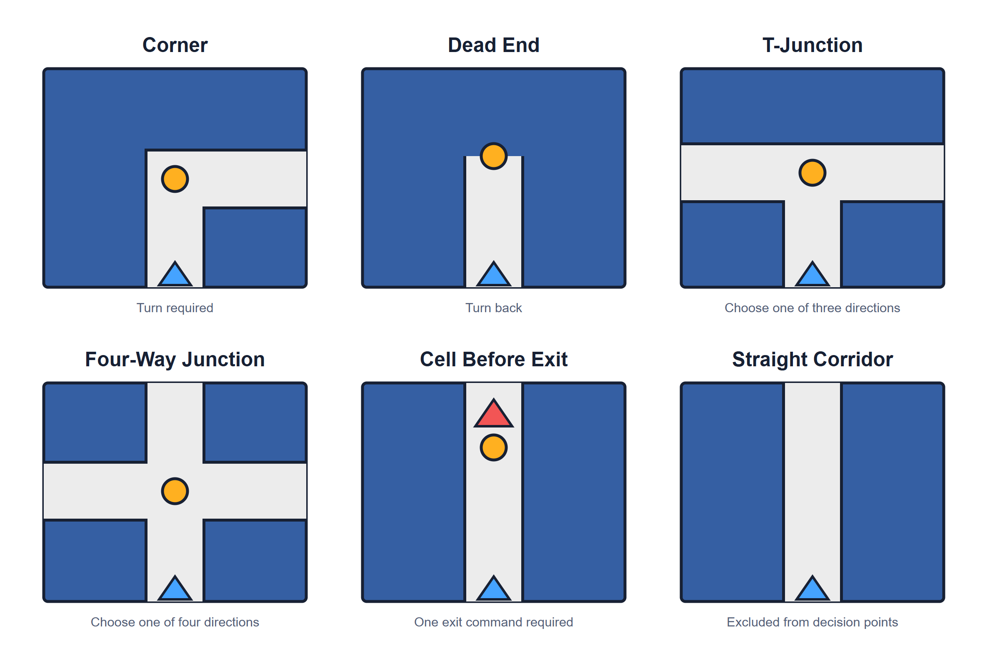
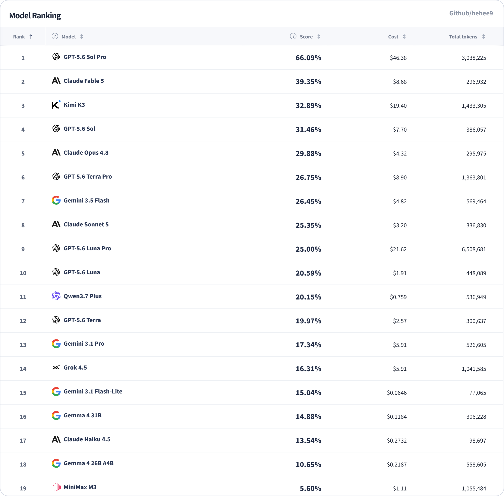
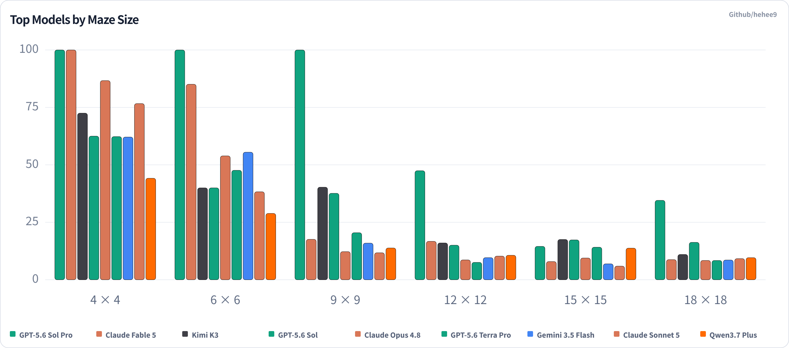

# Maze Bench: Evaluating Sequential Visual-Spatial Reasoning in Multimodal LLMs with Relative Direction Commands

**Author:** hehee9

## Abstract

Maze Bench is a benchmark in which multimodal models generate a movement-command sequence from a single maze image. At every corner, junction, and dead end, the model must output `S` (straight), `R` (right), `L` (left), or `B` (back) relative to its current heading; straight corridors are traversed automatically until the next decision point. The task jointly evaluates visual recognition of maze structure, route generation, relative-direction conversion, sequential state tracking, and output-format compliance, while reducing reliance on external factual knowledge.

The evaluated models followed different performance curves on small and large mazes, and wall collisions were the dominant failure type. In a post hoc analysis that intervened only once at the first collision, the remaining command sequence rarely stayed valid all the way to the goal. These results show the value of examining maze size, error type, and the span over which a model maintains state alongside its aggregate score when evaluating sequential visual-spatial reasoning.

---

## 1. Introduction

### 1.1 Background and Motivation

Comprehensive multimodal benchmarks combine image understanding with several forms of problem solving. MMMU uses 11,550 questions collected from college exams, quizzes, and textbooks to evaluate visual understanding, domain knowledge, and deliberate reasoning across 30 subjects.[1] HLE contains 2,500 expert-level academic questions, approximately 14% of which combine text and images.[2] The recently released GDP.pdf evaluates table, chart, and document-layout interpretation together with domain-specific judgment in real-world PDFs from ten professional fields.[3] These benchmarks intentionally measure combined performance across visual perception, domain knowledge, and reasoning, leaving room for a complementary evaluation in which the information needed to solve the task is contained in the image and task rules.

Some tasks, such as interpreting geometric nets or abstract figures, place less weight on external knowledge, but many still require a single answer from a single image. Maze Bench reduces the influence of background knowledge and requires a command sequence spanning multiple decision points in one image, creating a setting in which visual information, route planning, and state tracking must operate sequentially.

### 1.2 Prior Work

Several visual benchmarks have also been designed to reduce dependence on external factual knowledge.

- **BLINK** comprises 3,807 multiple-choice questions across 14 classical computer vision tasks, including relative depth estimation, visual correspondence, and multiview reasoning.[4]
- **PuzzleVQA** uses 2,000 abstract pattern problems involving colors, numbers, sizes, and shapes to analyze bottlenecks in visual perception and inductive and deductive reasoning.[5]
- **VisOnlyQA** evaluates fine-grained visual perception through 12 tasks centered on geometric properties such as angles, shapes, and sizes.[6]

VSP provides a close point of reference for visual maze planning. It asks models to generate a safe, complete movement plan from a fully observable grid image and measures how performance changes as maps grow from `3×3` to `8×8`. It also separates object perception, spatial relations, environment representation, and action-sequence safety to diagnose perception and reasoning bottlenecks.[7]

A benchmark with the same name, **MazeBench**, was introduced in the 2026 paper *From Pixels to BFS: High Maze Accuracy Does Not Imply Visual Planning*. It uses 110 procedurally generated maze images and asks models to determine reachability and, when a solution exists, return a shortest path in JSON. A result is marked `solved` according to path length and whether the returned path matches an accepted shortest path.[8]

### 1.3 Design Comparison

Table 1 summarizes the main design differences.

**Table 1. Design comparison of visual path-planning benchmarks**

| Aspect | VSP maze task | 2026 MazeBench | Maze Bench (this work) |
|---|---|---|---|
| Input | Grid image with task instructions and examples | Maze image with a fixed prompt | Maze image with a fixed prompt |
| Output unit | Per-cell up/down/left/right moves | Per-cell shortest-path JSON | Decision-point `S/R/L/B` commands |
| Direction frame | Absolute image directions | Absolute image directions | Directions relative to the player's heading |
| Straight corridors | One command per cell | One command per cell | Automatic movement to the next decision point |
| Primary scoring | Goal-reach success rate | Accepted shortest-path match | Final-position progress × route efficiency |
| Partial progress | Limited role in the primary metric | Binary `solved` decision | Continuous score from 0 to 100 |

The distinguishing design is the combination of **decision-point relative commands, automatic traversal of straight corridors, and a continuous score based on the final position**. This places more weight on repeatedly updating the current heading than on enumerating a long sequence of cell coordinates.

---

## 2. Benchmark Task and Design

### 2.1 Task and Measured Capabilities

The model must distinguish white passages from dark wall lines, determine how the passages connect, and find a route from the start to the goal in the perceived passage graph. Each input is a `2048×2048` image with no cell coordinates, grid labels, or textual representation of the passages. As the maze grows, each cell and wall occupies fewer pixels while the number of connections that must be recognized and linked also increases. A shortest-path solution receives the highest score, but a successful detour can receive partial credit according to its efficiency, and an incomplete output is scored from its final progress and efficiency.

The `S/R/L/B` commands are relative to the current heading rather than fixed to the image axes. For example, `R` means south when the player faces east and west when the player faces south. After every command, the model must update its position and heading, then convert the absolute direction of the next route segment into another relative command. The full sequence is generated in one response from the original image without intermediate feedback, so an earlier state-tracking error can also change the meaning of later commands. Larger mazes and additional decision points lengthen the state-tracking span.

A valid output may contain only the space-separated commands `S`, `R`, `B`, and `L`. Explanations, coordinates, reasoning text, or any other characters cause a format error. The scorer accepts a code block, but the fixed prompt restricts the output itself to command tokens and spaces.

The final score reflects all of these capabilities in combination. A wall collision may result from misreading a wall, but it may also occur after the model formed a correct map and then made an error in route generation or heading updates. Separating the contribution of each capability therefore requires staged diagnostics.

### 2.2 Maze Generation

The repository's `MazeGenerator` produces each maze as follows.

1. Begin with every wall between adjacent cells closed.
2. Choose a random cell and open walls toward unvisited neighbors to build a spanning tree that connects every cell.
3. As `wall_density` increases, the generator selects the most recently visited cell more often, producing longer corridors similar to depth-first search. This is a variation of the Growing Tree algorithm, in which the active-cell selection rule controls maze characteristics.[9]
4. Shuffle the remaining internal walls and remove a subset to introduce cycles and junctions.
5. After each removal, test whether it would create a fully open `2×2` area; cancel the removal if it would.

All evaluation mazes use a wall density of `0.7`. This is a generation parameter that controls the balance between long corridors and additional openings, not the literal proportion of image area occupied by walls.[^wall-density] The target number of additional openings is the number of remaining candidate walls multiplied by `(1-0.7)×0.35`.

[^wall-density]: The probability of selecting the most recent cell is `0.15 + 0.85d`; when `d=0.7`, this becomes `0.15 + 0.85×0.7 = 0.745`.

Preventing fully open `2×2` areas keeps passages one cell wide and reduces ambiguity when identifying corners and junctions in open spaces.

### 2.3 Start and Goal Placement and the Evaluation Set

The start and goal are outside the maze and are marked by blue and red arrows, respectively. The blue arrow points into the maze, and the red arrow points out. The first command is always `S`; from the final interior cell, the model must issue one additional command toward the exit to complete the maze.

The five problems at each maze size use the following relationships between the start and goal sides:

- adjacent sides: 2 problems
- opposite sides: 2 problems
- the same side: 1 problem

The start and goal cells occupy different positions. Each problem's random seed, passage connections, and reference path are stored in JSON, allowing the same evaluation problem to be reconstructed and rescored.

The evaluation set contains six square maze sizes.

**Table 2. Maze sizes and problem counts**

| Group | Maze sizes | Problems |
|---|---|---:|
| Easy | `4×4`, `6×6` | 10 |
| Medium | `9×9`, `12×12` | 10 |
| Hard | `15×15`, `18×18` | 10 |
| Total | 6 sizes | 30 |


*Figure 1. Example 9×9 input image.*

White areas are traversable cells, and dark lines are walls. The image shows only passages and walls, without cell-boundary grid lines or coordinates. Color and arrow direction jointly distinguish the start and goal. Confusing these markers is outside the main focus on passage recognition and sequential state tracking, so the two markers were designed to be as clear as possible.

### 2.4 Decision-Point Graph

The scorer compresses cell-level passages into a decision-point graph. The following locations are treated as decision points:

- corners
- dead ends
- T-junctions and four-way junctions
- the final interior cell before the exit

After a command is executed, a straight corridor with no intervening corner or junction is traversed automatically to the next decision point. The model must therefore understand the maze structure well enough to choose the correct direction at each location where a decision is required.



*Figure 2. Locations that require a command and a straight corridor excluded from the decision-point graph. Orange circles mark decision points, blue triangles indicate the incoming direction, and the red triangle marks the exit.*

---

## 3. Input, Output, and Scoring

### 3.1 Command Semantics

**Table 3. Relative direction commands**

| Command | Meaning |
|---|---|
| `S` | Continue straight in the current heading |
| `R` | Turn right relative to the current heading |
| `L` | Turn left relative to the current heading |
| `B` | Move back in the direction opposite the current heading |

For example, if the player reaches a corner while facing east and chooses the passage to the south, the correct command is `R`. The player then faces south. If the route turns east at the next decision point, the next command is `L`.

The following is a valid response:

```text
S S R S L R
```

### 3.2 Execution Rules

The scorer applies the first command while the player is outside the maze. At each decision point, it converts the relative command to an absolute direction and checks whether a passage exists in that direction.

- If the passage is open, the player advances to the next decision point and the heading is updated.
- If the command points into a wall, execution terminates immediately with a collision.
- If the command sequence ends first, execution terminates as incomplete at the current position.
- If the player reaches the exit, execution terminates successfully.
- A response with a format error receives zero independently of its path score.

### 3.3 Score

The score for one problem is

$$
\text{Score}=100\times P\times E
$$

where

$$
P=\frac{m}{m+r},\qquad E=\frac{D}{m+r}.
$$

- \(D\): the minimum number of decision commands required from the start to the exit
- \(m\): the number of commands executed successfully before termination, excluding the command that caused a collision
- \(r\): the minimum number of commands from the final position and heading to the exit
- \(P\): progress measured from the final position
- \(E\): the ratio between the optimal command count and the sum of executed and remaining commands

Two examples from the actual results illustrate the calculation:

- **Successful detour:** For \(D=30\), \(m=33\), and \(r=0\), \(P=33/(33+0)=1\) and \(E=30/(33+0)\approx0.9091\), yielding 90.91 points.
- **Incomplete or collision termination:** For \(D=27\), \(m=22\), and \(r=8\), \(P=22/(22+8)\approx0.7333\) and \(E=27/(22+8)=0.9\), yielding 66.00 points.

A shortest-path success has \(m=D\) and \(r=0\), so it receives 100 points. A successful detour has \(m>D\), reducing its efficiency component. An incomplete or collided run can still receive partial credit based on the distance remaining from its final position.

An earlier formula multiplied progress by `minimum move count / actual move count`. If a response followed the shortest path correctly and then collided with a wall, the progress and efficiency terms could cancel in a way that produced a perfect score. The current formula avoids this outcome by placing executed commands and the final remaining distance in the same denominator.

Scoring uses the **position at which execution terminates**. If the route enters a wrong branch and moves away from the exit, that state is reflected in the score. A less efficient route that maintains a coherent state for longer can score higher than an output that follows the optimal path briefly and collides early. Rewarding sustained state tracking is an intentional property of the metric.

A model's aggregate score is the arithmetic mean of its per-maze scores. For a model evaluated on \(N\) problems,

$$
\text{Model Score}=\frac{1}{N}\sum_{i=1}^{N}\text{Score}_i.
$$

The official aggregate score uses \(N=30\), and each size-specific score is the arithmetic mean of the five problems at that size.

---

## 4. Experimental Setup

### 4.1 Execution Conditions

- Fixed prompt: the same English instructions from `scripts/prompt.md` for every model
- Input: one maze image per API request
- Repetitions: one run for each model configuration and maze pair
- Sample: 6 sizes × 5 problems per size = 30 problems
- Output limit: the maximum configured within the range supported by each model API
- Reasoning configuration: `medium` effort or an 8K-token budget when supported; reasoning enabled when effort control was unavailable
- API route: the model developer's official API or a route on OpenRouter served directly by that developer
- Other generation parameters: API defaults

**Table 4. Reasoning settings and output limits**

| Model configuration | Reasoning setting | Output limit |
|---|---|---:|
| GPT-5.6 family | `medium`, standard and Pro modes | 128,000 |
| Claude Fable 5, Opus 4.8, and Sonnet 5 | `medium` | 128,000 |
| Claude Haiku 4.5 | 8K reasoning | 64,000 |
| Gemini 3.1 and 3.5 families | `medium` | 65,536 |
| Gemma 4 family | `high` reasoning | 32,768 |
| Grok 4.5 | `medium` | 256,000 |
| Kimi K3 | reasoning enabled[^kimi] | 128,000 |
| MiniMax M3 | reasoning enabled | 256,000 |
| Qwen3.7 Plus | reasoning enabled | 65,536 |

The report identifies model configurations by display name and reasoning setting. Provider, model identifier, reasoning configuration, and pricing fields needed to reproduce each run are stored in the result JSON.

For the GPT-5.6 family, `Pro` is an official parallel-reasoning mode provided by OpenAI through the Responses API. It is enabled by retaining the Sol, Terra, or Luna model identifier and setting `reasoning.mode` to `pro`; reasoning effort is configured independently.[10]

[^kimi]: Kimi K3 had announced plans to support reasoning-effort controls, but the controls were unavailable at the time of evaluation.

### 4.2 Error and Cost Handling

Failed API requests were retried up to three times with exponential backoff. The reported results include only runs for which an API response was received and scored. A normally returned response with recorded token usage remained part of the evaluation even when its output violated the required format.

Costs were calculated by multiplying recorded input and output tokens by the configured price for each model. Cached-input discounts were excluded because first-request cache eligibility, automatic cache state, and cache policies differ across providers.

Google's API provided Gemma 4 input and output at a price of zero. To make the cost comparison informative, the report applies the separately configured OpenRouter serving rate for Gemma 4.

---

## 5. Results

### 5.1 Overall Results

Each of the 19 model configurations was evaluated on all 30 problems, producing 570 scored responses. A model's aggregate score is the arithmetic mean of its 30 problem scores.

**Table 5. Outcome counts and rates**

| Outcome | Count | Rate |
|---|---:|---:|
| Reached the goal | 43 | 7.54% |
| Wall collision | 466 | 81.75% |
| Output-format error | 43 | 7.54% |
| Collision-free incomplete | 18 | 3.16% |

Wall collisions were the most common outcome, accounting for 81.75% of all responses. Partial scores reflect both the movement completed before termination and the final position.

### 5.2 Results by Model

**Table 6. Aggregate scores and outcome distributions by model (n=30 per model)**

| Model | Score | Success | Collision | Format error | Incomplete | Total run cost (USD) |
|---|---:|---:|---:|---:|---:|---:|
| GPT-5.6 Sol Pro (medium) | 66.09 | 16 | 14 | 0 | 0 | 46.38 |
| Claude Fable 5 (medium) | 39.35 | 8 | 21 | 0 | 1 | 8.68 |
| Kimi K3 (thinking) | 32.89 | 1 | 26 | 1 | 2 | 19.40 |
| GPT-5.6 Sol (medium) | 31.46 | 1 | 27 | 0 | 2 | 7.70 |
| Claude Opus 4.8 (medium) | 29.88 | 5 | 24 | 0 | 1 | 4.32 |
| GPT-5.6 Terra Pro (medium) | 26.75 | 2 | 25 | 2 | 1 | 8.90 |
| Gemini 3.5 Flash (medium) | 26.45 | 3 | 25 | 1 | 1 | 4.82 |
| Claude Sonnet 5 (medium) | 25.35 | 3 | 26 | 0 | 1 | 3.20 |
| GPT-5.6 Luna Pro (medium) | 25.00 | 1 | 26 | 1 | 2 | 21.62 |
| GPT-5.6 Luna (medium) | 20.59 | 1 | 27 | 1 | 1 | 1.91 |
| Qwen3.7 Plus (thinking) | 20.15 | 1 | 27 | 1 | 1 | 0.76 |
| GPT-5.6 Terra (medium) | 19.97 | 0 | 28 | 1 | 1 | 2.57 |
| Gemini 3.1 Pro (medium) | 17.34 | 1 | 27 | 2 | 0 | 5.91 |
| Grok 4.5 (medium) | 16.31 | 0 | 21 | 8 | 1 | 5.91 |
| Gemini 3.1 Flash-Lite (medium) | 15.04 | 0 | 28 | 0 | 2 | 0.06 |
| Gemma 4 31B (thinking) | 14.88 | 0 | 29 | 1 | 0 | 0.12 |
| Claude Haiku 4.5 (8K Thinking) | 13.54 | 0 | 30 | 0 | 0 | 0.27 |
| Gemma 4 26B A4B (thinking) | 10.65 | 0 | 25 | 4 | 1 | 0.22 |
| MiniMax M3 (thinking) | 5.60 | 0 | 10 | 20 | 0 | 1.11 |

Costs use the configured rates before cache discounts. Gemma was run through Google's free API, but an external serving rate was applied for the cost comparison.



*Figure 3. Mean scores for the 19 model configurations.*

### 5.3 Performance by Maze Size

Overall performance generally declined as maze size increased, but the decline was nonlinear, and individual model curves were not monotonically decreasing. Model rankings also changed across sizes. The mean across all 19 configurations fell from `4×4` through `15×15` and then rose slightly at `18×18`. GPT-5.6 Sol Pro scored 100 on all three smaller sizes before declining and rebounding on the larger sizes. The relative order of Claude Fable 5 and GPT-5.6 Sol also reversed across maze sizes.

**Table 7. Easy- and hard-range mean scores for selected models**

| Model | Easy mean (`4×4`, `6×6`) | Hard mean (`15×15`, `18×18`) |
|---|---:|---:|
| GPT-5.6 Sol Pro | 100.00 | 24.54 |
| Claude Fable 5 | 92.54 | 8.34 |
| Claude Opus 4.8 | 70.29 | 8.93 |
| Kimi K3 | 56.24 | 14.27 |
| GPT-5.6 Sol | 51.24 | 16.81 |
| Qwen3.7 Plus | 36.51 | 11.68 |
| GPT-5.6 Terra | 34.72 | 10.40 |



*Figure 4. Scores by maze size for selected fully evaluated models. Each size has `n=5` problems.*

Table 7 and Figure 4 show the model-level variation. Because each size contains five problems and every model-problem pair was run once, the differences and rank reversals reported here are descriptive statistics. Statistical significance should be evaluated after increasing the number of problems and repeated runs.

---

## 6. Error Types and Case Analysis

### 6.1 Wall Collisions

Of the 527 format-valid outputs, 466 terminated in a wall collision. Plausible causes include:

- misperceiving a wall or passage connection in the image
- perceiving the maze correctly but generating an incorrect route
- updating the heading incorrectly at an earlier corner
- losing track of position or route state, causing later relative commands to diverge
- producing a correct command sequence internally but altering a token during output generation

The final command sequence alone cannot distinguish these causes. The post hoc recovery analysis in Section 7 measures the validity of the remaining commands after the first collision, while Section 9.4 proposes a staged evaluation to identify the earliest failing component.

### 6.2 Output-Format Errors

Forty-three responses violated the output format and received zero independently of their path.

- 8 terminated in connection with the maximum output limit.
- 35 ended normally but included explanations or other text beyond `S/R/L/B`.
- Grok 4.5 produced 8 format errors.
- MiniMax M3 produced format errors on 20 of 30 problems.

All eight Grok 4.5 format errors terminated before reaching the 256,000-token output limit. Six recorded reasoning tokens but returned an empty final-response string, leaving no command sequence to extract; only the other two contained a final-response string. This was too small and inconsistent a set for the same kind of auxiliary rescoring applied to MiniMax M3.

MiniMax M3 often generated a command sequence, described a perceived error or repetition, and then revised the sequence within the same response. This reasoning-like text also appeared in the final output and failed the strict format check.

In 19 of MiniMax M3's 20 format-error responses, the final portion contained a standalone line made exclusively of `S/R/L/B` commands. Manually extracting and rescoring only that last line raises its 30-problem mean from 5.60 to **15.39**, with zero goal completions. This auxiliary calculation applies post hoc parsing outside the fixed scoring rule; the leaderboard therefore retains the original score.

### 6.3 Collision-Free Incomplete Outputs

Eighteen responses ended before the exit without recording a collision. Because their formats were valid, they received partial credit based on progress and efficiency at the final position. This category can include a model stopping because it believed the route had already left the maze, failing to generate the full sequence, or omitting the final command from the cell immediately before the exit.

Eight of the 18 collision-free incomplete responses (44.44%) stopped in the final interior cell adjacent to the exit. In every case, the submitted sequence was an exact prefix of the reference sequence with only the final `S` missing. Appending `S` completes the optimal route.

**Table 8. Cases that stopped in the final interior cell**

| Model | Maze | Submitted sequence | Missing command | Score |
|---|---|---|---:|---:|
| GPT-5.6 Sol | `4×4` · adjacent sides, case 1 (`maze_04x04_adjacent_01`) | `S L R L S` | `S` | 83.33 |
| GPT-5.6 Terra Pro | `4×4` · adjacent sides, case 1 (`maze_04x04_adjacent_01`) | `S L R L S` | `S` | 83.33 |
| Kimi K3 | `4×4` · adjacent sides, case 1 (`maze_04x04_adjacent_01`) | `S L R L S` | `S` | 83.33 |
| Gemini 3.5 Flash | `4×4` · adjacent sides, case 1 (`maze_04x04_adjacent_01`) | `S L R L S` | `S` | 83.33 |
| Grok 4.5 | `4×4` · adjacent sides, case 1 (`maze_04x04_adjacent_01`) | `S L R L S` | `S` | 83.33 |
| GPT-5.6 Luna Pro | `6×6` · adjacent sides, case 2 (`maze_06x06_adjacent_02`) | `S R L R L L S` | `S` | 87.50 |
| Claude Opus 4.8 | `6×6` · adjacent sides, case 2 (`maze_06x06_adjacent_02`) | `S R L R L L S` | `S` | 87.50 |
| Claude Sonnet 5 | `6×6` · adjacent sides, case 2 (`maze_06x06_adjacent_02`) | `S R L R L L S` | `S` | 87.50 |

These were the only two problems among the 30 whose optimal sequence ended in `S S`. Table 9 groups all outputs that either reached the exit or followed the correct route to the final interior cell by whether the required exit command repeated the preceding command.

**Table 9. Omission distribution by whether the exit command repeats the previous command**

| Final command pattern | Completed the exit | Omitted the final exit command |
|---|---:|---:|
| Same as the preceding command | 6 | 8 |
| Different from the preceding command | 37 | 0 |

The observed distribution is more consistent with a **rule-interpretation error at the boundary between automatic straight-corridor traversal and the special handling of the goal cell**. An ordinary straight corridor advances automatically to the next decision point, whereas the goal-adjacent cell is itself a decision point. A visually continuous straight segment therefore requires two `S` commands. If a model interpreted the first `S` as sufficient to reach the red arrow, the eight outputs that stopped exactly in the final interior cell follow naturally.

An alternative explanation is that the model collapsed consecutive identical commands. However, the three `6×6` omission cases preserved `L L` in the middle of the sequence, weakening a general command-deduplication hypothesis and supporting an interpretation specific to the final `S`. Because all eight omissions are concentrated in two small mazes with the same ending structure, this explanation remains a hypothesis for a controlled follow-up experiment.

The fixed prompt explicitly requires one additional command from the final interior cell toward the exit, so the original scores were retained. In an auxiliary calculation that appends the missing final `S`, successful runs increase from 43 to 51 and the success rate from 7.54% to 8.95%. The affected models' aggregate means rise by 0.42 to 0.56 points.

Format errors and stops in the final interior cell can be inspected directly from the final output. Wall collisions require replaying the remaining commands from an altered state to examine how far the failure extends, motivating the one-intervention post hoc diagnostic in the next section.

---

## 7. First-Collision Post Hoc Recovery Analysis

Wall collisions were the largest error category in Section 6, with 466 cases. This section replays all of them to measure how long the remaining command sequence stays valid after one correction to the first colliding command. Official scores and leaderboard values continue to use the original outputs.

### 7.1 Single-Intervention Analysis of All Collisions

Before applying an intervention, the analysis reproduced each case's score, executed-command count, final remaining distance, event, and heading with the same scorer that generated the public results. Each intervention was applied only once at the first collision. The original remaining commands were then replayed unchanged, and the analysis stopped at a second collision.

1. **Ignore the command:** Delete the colliding command, retain the current position and heading, and replay the remainder.
2. **Replace it with a valid command:** Try every valid relative command available immediately before the collision. Select the most favorable candidate by goal completion, number of subsequent commands executed, and score, in that order.
3. **Remove one wall:** Treat the wall involved in the first collision as absent and replay the remaining original commands.

**Table 10. Outcomes by single-intervention method**

| Intervention | Eligible cases | Reached the goal | Avoided a second collision among cases with remaining commands | Median subsequent valid commands | Maximum |
|---|---:|---:|---:|---:|---:|
| Ignore the colliding command | 466 | 2 (0.43%) | 25/443 (5.64%) | 1 | 6 |
| Try every valid replacement and select the best | 466 | 0 (0%) | 35/443 (7.90%) | 1 | 12 |
| Remove one internal wall | 366 | 12 (3.28%) | 29/349 (8.31%) | 1 | 15 |

Wall removal was eligible in 366 cases. The excluded 100 consisted of 92 attempts to leave through an outer boundary other than the designated exit and 8 collisions while the player was still outside the start.

The two successes from ignoring the command and the twelve successes from wall removal occurred in different cases. At least one method reached the goal in **14/466 cases (3.00%)**, while **452/466 cases (97.00%)** still failed after the single intervention. Trying every valid replacement and selecting the best candidate produced no goal completions.

The median number of subsequent valid commands was one for all three methods. Ten cases continued for at least five commands after ignoring the collision, eleven after a valid replacement, and twenty-three after wall removal. One replacement case and three wall-removal cases continued for at least ten commands.

This analysis measures the validity of the remaining sequence after the first collision. Wall removal changes the maze and can create a new shortcut, so it is used only as a diagnostic measure. The findings are limited to post-collision sequence validity; the model's internal map, intent, number of perceived wall errors, and earliest failing stage remain targets for the staged evaluation proposed in Section 9.4.

### 7.2 Distribution of Successful Recoveries

The 14 successful recoveries were concentrated in smaller mazes, although three GPT-5.6 Sol Pro cases occurred at `12×12` and `18×18`.

**Table 11. First-collision recovery success by maze size**

| Maze size | All collisions | Reached the goal after at least one recovery method | Rate |
|---|---:|---:|---:|
| `4×4` | 59 | 7 | 11.86% |
| `6×6` | 66 | 3 | 4.55% |
| `9×9` | 82 | 0 | 0% |
| `12×12` | 87 | 3 | 3.45% |
| `15×15` | 90 | 0 | 0% |
| `18×18` | 82 | 1 | 1.22% |

**Table 12. First-collision recovery successes**

| Model | Maze | Recovery method |
|---|---|---|
| GPT-5.6 Terra | `4×4` · adjacent sides, case 2 (`maze_04x04_adjacent_02`) | Ignore command |
| GPT-5.6 Luna | `4×4` · adjacent sides, case 2 (`maze_04x04_adjacent_02`) | Ignore command |
| Gemma 4 26B A4B | `4×4` · adjacent sides, case 2 (`maze_04x04_adjacent_02`) | Remove one wall |
| Claude Opus 4.8 | `4×4` · adjacent sides, case 1 (`maze_04x04_adjacent_01`) | Remove one wall |
| Gemini 3.1 Pro | `4×4` · opposite sides, case 4 (`maze_04x04_opposite_04`) | Remove one wall |
| Gemini 3.1 Pro | `4×4` · same side, case 5 (`maze_04x04_same_05`) | Remove one wall |
| Gemma 4 26B A4B | `4×4` · same side, case 5 (`maze_04x04_same_05`) | Remove one wall |
| Grok 4.5 | `6×6` · opposite sides, case 3 (`maze_06x06_opposite_03`) | Remove one wall |
| Claude Opus 4.8 | `6×6` · opposite sides, case 4 (`maze_06x06_opposite_04`) | Remove one wall |
| Claude Sonnet 5 | `6×6` · same side, case 5 (`maze_06x06_same_05`) | Remove one wall |
| GPT-5.6 Sol Pro | `12×12` · adjacent sides, case 2 (`maze_12x12_adjacent_02`) | Remove one wall |
| GPT-5.6 Sol Pro | `12×12` · opposite sides, case 3 (`maze_12x12_opposite_03`) | Remove one wall |
| Gemma 4 31B | `12×12` · adjacent sides, case 1 (`maze_12x12_adjacent_01`) | Remove one wall |
| GPT-5.6 Sol Pro | `18×18` · adjacent sides, case 1 (`maze_18x18_adjacent_01`) | Remove one wall |

Across `4×4` and `6×6`, 10 of 125 collisions (8.00%) were recovered. Across the other four sizes, 4 of 341 (1.17%) were recovered. The median distance remaining at the first collision was 7 commands for successful cases and 17 for failed cases; the median number of commands left in the output was 4 and 9, respectively. A single intervention tended to work when both the remaining route and the remaining output were short.

The 14 cases were distributed across nine model configurations. GPT-5.6 Sol Pro accounted for three; Gemini 3.1 Pro, Gemma 4 26B A4B, and Claude Opus 4.8 accounted for two each; the other five configurations accounted for one each.

By problem, `maze_04x04_adjacent_02` produced three recoveries and `maze_04x04_same_05` produced two. Both successful ignore-command cases occurred on `maze_04x04_adjacent_02`. Separating a general small-maze effect from an individual-problem effect will require more mazes and repeated runs; Section 8.2 discusses how this sample scope limits interpretation of the recovery results.

---

## 8. Discussion

### 8.1 Maze Size and Performance Curves

Aggregate performance generally declined with maze size, but individual models differed in where their scores fell and where they rebounded. Success on smaller mazes and the ability to sustain longer command sequences were reflected differently across performance curves, producing different leading models at different sizes. The aggregate score summarizes combined performance over the full set, while size-specific curves and easy-versus-hard range scores provide a more detailed account of these differences.

As maze size increases, each cell occupies fewer pixels while the number of passage connections and decision points also grows. The current experiment does not isolate these factors, so it cannot attribute the decline to one of them. The resolution-reduction and staged failure analyses proposed in Section 9 are intended to separate their effects.

### 8.2 Error Types and Single-Intervention Recovery

Wall collision was the most common failure type, and 97.00% of collided outputs still failed after one intervention at the first collision. Cases in which correcting only the first colliding command preserved the entire remaining sequence were therefore rare, indicating a limited scope for recovery from a single local error. The analysis directly measures only the persistence of the remaining command sequence; staged experiments are required to distinguish whether the earliest error occurred in wall perception, route planning, direction conversion, or state tracking.

The 14 successful recoveries were concentrated in a few smaller mazes and individual problems. Any relationship between recovery and maze size or structure should therefore be evaluated with more problems and repeated runs under the same conditions.

Omission of the final `S` was a different recurring error. Its concentration in the same ending structure, together with the preservation of repeated commands in the middle of the sequence, makes an interpretation error around the special goal-cell rule more plausible. Format-error cases also show that the ability to package a planned route into the required command-only response contributes to the evaluation outcome.

### 8.3 Scope of the Score and Model Comparisons

All information needed to solve a Maze Bench problem is contained in the input image and command rules, and scoring is determined by maze connectivity and command execution. This design reduces the role of domain-specific factual knowledge. The final score still combines visual perception, route planning, relative-direction conversion, state tracking, and format compliance, and should be interpreted as the combined result of those capabilities. Error categories and staged follow-up diagnostics can then investigate individual components.

Product tier and publicly reported parameter count did not show a consistent ordering with Maze Bench score. Gemini 3.5 Flash scored 9.11 points above Gemini 3.1 Pro. The score difference between Grok 4.5, reported to be based on a 1.5-trillion-parameter V9 foundation model[11], and Gemma 4 31B was 1.43 points.[12] The scope of this comparison is limited to the 30 mazes and execution settings evaluated here.

---

## 9. Limitations and Future Work

### 9.1 Lack of Repeated Runs

Each model-problem pair was run once. Because generative-model outputs can vary under the same conditions, the reported scores include run-to-run variation. Repeating every fully evaluated configuration would substantially increase API cost, making multi-run averages difficult for an individual project.

Future evaluations could repeat every model an equal number of times or first estimate confidence intervals by repeating a selected set of representative models and boundary cases. More of the repetition budget could then be allocated to configurations with greater observed variability.

### 9.2 Problem Count and Maze Patterns

The evaluation set contains five problems per size and 30 problems in total, all square mazes generated with one wall-density setting. Rectangular mazes, asymmetric aspect ratios, different wall densities, long isolated corridors, junction-heavy layouts, and highly cyclic mazes would broaden coverage.

Future sets should vary the following factors independently:

- width and height
- shortest-path command count
- number of corners and junctions
- number of dead ends
- number of cycles
- relationship between the start and goal sides
- controlled image downscaling with image resolution and wall thickness varied independently

Another research question is **whether models fail disproportionately on particular maze patterns and, if so, which structural properties are associated with those failures**. After controlling for maze size and shortest-path length, failure rates can be compared across the number and placement of corners, junctions, dead ends, and cycles; consecutive-turn segments; and start-goal side relationships. If a pattern emerges, the first collision location, preceding commands, required direction change, remaining distance, and error type can be compared to determine whether failure is most closely associated with visually dense wall regions, route choice at multiway branches, relative-direction conversion, or long-range state tracking. Matched mazes that change only one suspected factor can then test the resulting causal hypothesis.

To test the main hypothesis for the missing final `S` and distinguish it from command deduplication, a diagnostic set could hold path length and difficulty approximately constant while crossing whether the last two commands repeat with whether the final interior cell lies on a straight segment or at a corner.

The original images use high-contrast black-and-white lines and one-cell-wide passages at `2048×2048`, and their connectivity remains visually distinguishable after substantial downscaling. Public specifications state that Claude Fable 5 supports up to 4,784 vision tokens and a high-resolution range up to 2,576 pixels on the long edge,[13] Gemini divides large images into `768×768` tiles,[14] and Kimi recommends image inputs no larger than 4K.[15] Input resolution is therefore unlikely to be the primary bottleneck, although a controlled downscaling experiment is needed to test this inference.

### 9.3 Properties of the Score

The current formula can assign a higher score to an inefficient route that remains valid for a long time than to a route that follows the optimal path briefly and then collides. This is intentional: the metric rewards sustained state tracking as well as shortest-path efficiency.

Future dashboard versions could present the aggregate score alongside the following diagnostic metrics:

- goal-reach rate
- shortest-path success rate
- number of valid commands before the first collision
- final remaining distance
- route efficiency
- format-compliance rate

### 9.4 Separating Failure Stages

The final command sequence contains the combined result of perception and planning. A follow-up evaluation could divide the same maze into two stages:

1. Convert the image into a prescribed textual representation or adjacency matrix of cell connectivity.
2. Provide the correct structure in text and ask the model to generate the same `S/R/L/B` route.

Failure in the first stage would point more directly to passage perception. Correct conversion followed by failure in the second stage would implicate route search or heading-state maintenance more directly. VSP's perception, environment-representation, and action-safety subtasks and the text-grid ablation in the 2026 MazeBench study also support this decomposition.[7][8]

### 9.5 Limits on Comparing Reasoning Processes

Comparing solution strategies across models would require intermediate reasoning records in a consistent format, but APIs differ in what they expose and how they format it. This evaluation therefore centers on final outputs and token usage, which were available for every model. Reasoning-like text exposed in a final response was used only in the format-error analysis.

---

## 10. Conclusion

Maze Bench evaluates visual structure recognition, route generation, relative-direction conversion, and sequential state tracking in a maze task designed to reduce the influence of external factual knowledge. Decision-point relative commands and final-position partial scoring provide a consistent measure of goal completion, route efficiency, and sustained state tracking, while output-format compliance remains part of task performance.

Across 570 responses from 19 model configurations, 43 reached the goal and 466 ended in wall collisions. The overall mean generally declined with maze size, but the decline was nonlinear, and individual curves and size-specific leaders differed. GPT-5.6 Sol Pro achieved the highest aggregate score at 66.09 and scored 100 on every problem from `4×4` through `9×9`, followed by substantial variation on larger mazes. In the first-collision post hoc analysis, only 14 of 466 cases reached the goal after one intervention, and the remaining sequence rarely stayed valid after correcting a single colliding command. Missing exit commands and format errors were also recurring obstacles to successful completion.

The aggregate score is the primary measure for comparing combined task performance. Size-specific curves, state-tracking spans, and error types provide additional context for explaining where score differences arise. Future work should add repeated runs and structurally controlled mazes, then separate extraction of maze connectivity from command-sequence generation. These experiments would test the stability of the performance curves and identify more directly whether the main failure stage lies in visual perception, route planning, relative-direction conversion, or long-range state tracking.

---

## Appendix A. Fixed Prompt

```text
Find the command sequence that moves from the blue arrow, which marks the starting point, to the red arrow, which marks the destination, in the attached maze image.

## Rules

- The starting point and destination are outside the maze.
- The first command must be S. It represents entering the maze from outside.
- All subsequent commands are relative to the direction you are currently facing.
- At every junction, corner, and dead end encountered along the route, output one of the following movement commands: straight (S), right (R), left (L), or back (B).
- At a corner, output L or R even if it is the only open direction. At a dead end, output B.
- Straight corridors are traversed automatically until the next decision point.
- Reaching the destination in fewer commands earns a higher score.
- Choosing a direction blocked by a wall results in failure.
- From the final interior cell directly in front of the exit, output one last command toward the exit marked by the red arrow to leave the maze.

## Output Format

- Output only the commands S, R, B, and L, separated by spaces.
- Do not output explanations, reasoning, coordinates, or code blocks.
- Example: `S S R S L R`
```

---

## Appendix B. Individual Run: Backtracking Through a Bent Passage

GPT-5.6 Sol Pro executed the following 18 commands without collision on `maze_18x18_opposite_04`:

```text
S R L R R R B L S L R R L L R R L L
```

After `B`, it retraced the immediately preceding passage, selected `L` at the previous corner, and continued backward along an earlier segment. It backtracked across two segments including a bend, entered a different branch, and then executed ten more valid commands before colliding with a wall. The run ended before reaching the goal. It is the only observed case in the current results where backtracking through a corner and subsequent progress along a new branch occurred within one continuous command sequence.

---

## Appendix C. Resources and Reproducibility

- Repository: [github.com/hehee9/maze-bench](https://github.com/hehee9/maze-bench)
- Interactive dashboard: [GitHub Pages](https://hehee9.github.io/maze-bench/public/leaderboard.html)
- Replay viewer: [Maze Replay](https://hehee9.github.io/maze-bench/public/index.html)
- Hugging Face Space: [Hehee-dev/maze-bench](https://huggingface.co/spaces/Hehee-dev/maze-bench)
- Results: [`public/benchmark_results.json`](./public/benchmark_results.json)
- Problem set: [`maze_sets/`](./maze_sets/)
- Generation and scoring code: [`scripts/maze_benchmark.py`](./scripts/maze_benchmark.py)

Problem JSON files contain passage connectivity, the decision-point graph, shortest paths, and random seeds. The result file contains model outputs, token usage, scores, and aggregates.

---

## References

- [1] Xiang Yue et al., “[MMMU: A Massive Multi-discipline Multimodal Understanding and Reasoning Benchmark for Expert AGI](https://openaccess.thecvf.com/content/CVPR2024/html/Yue_MMMU_A_Massive_Multi-discipline_Multimodal_Understanding_and_Reasoning_Benchmark_for_CVPR_2024_paper.html),” CVPR 2024.

- [2] Center for AI Safety, Scale AI & HLE Contributors Consortium, “[A Benchmark of Expert-Level Academic Questions to Assess AI Capabilities](https://www.nature.com/articles/s41586-025-09962-4),” *Nature* 649, 1139–1146, 2026.

- [3] Suhaas Garre et al., “[GDP.pdf: Benchmarking Grounded Multimodal Reasoning over Professional PDF Documents](https://arxiv.org/abs/2607.11192),” arXiv:2607.11192, 2026.

- [4] Xingyu Fu et al., “[BLINK: Multimodal Large Language Models Can See but Not Perceive](https://zeyofu.github.io/blink/),” ECCV 2024.

- [5] Yew Ken Chia et al., “[PuzzleVQA: Diagnosing Multimodal Reasoning Challenges of Language Models with Abstract Visual Patterns](https://aclanthology.org/2024.findings-acl.962/),” Findings of ACL 2024.

- [6] Ryo Kamoi et al., “[VisOnlyQA: Large Vision Language Models Still Struggle with Visual Perception of Geometric Information](https://visonlyqa.github.io/),” COLM 2025.

- [7] Qiucheng Wu et al., “[VSP: Diagnosing the Dual Challenges of Perception and Reasoning in Spatial Planning Tasks for MLLMs](https://openaccess.thecvf.com/content/ICCV2025/html/Wu_VSP_Diagnosing_the_Dual_Challenges_of_Perception_and_Reasoning_in_ICCV_2025_paper.html),” ICCV 2025.

- [8] Alberto Gonzalo Rodriguez Salgado, “[From Pixels to BFS: High Maze Accuracy Does Not Imply Visual Planning](https://aclanthology.org/2026.alvr-main.13/),” ALVR 2026; [official repository](https://github.com/alrod97/LLMs_mazes).

- [9] Y. F. Hendrawan, “[A Maze Game on Android Using Growing Tree Method](https://doi.org/10.1088/1742-6596/953/1/012148),” *Journal of Physics: Conference Series* 953, 012148, 2018.

- [10] OpenAI, “[Model guidance: Pro mode](https://developers.openai.com/api/docs/guides/latest-model#pro-mode),” accessed July 20, 2026.

- [11] Elon Musk, “[Grok 4.5 is based on our 1.5T V9 foundation model](https://x.com/elonmusk/status/2071184354756477041),” X, accessed July 20, 2026.

- [12] Google, “[Gemma 4 model card](https://ai.google.dev/gemma/docs/core/model_card_4),” accessed July 20, 2026.

- [13] Anthropic, “[Vision](https://platform.claude.com/docs/en/build-with-claude/vision),” accessed July 19, 2026.

- [14] Google, “[Image understanding](https://ai.google.dev/gemini-api/docs/image-understanding),” accessed July 19, 2026.

- [15] Moonshot AI, “[Use the Kimi Vision Model](https://platform.kimi.ai/docs/guide/use-kimi-vision-model),” accessed July 19, 2026.
