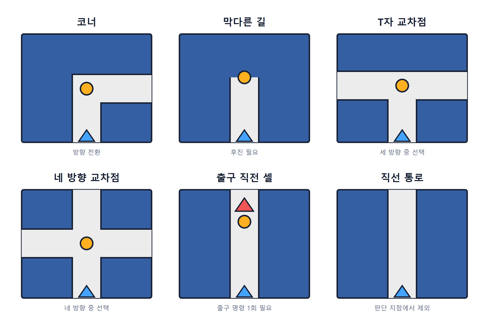

# Maze Bench: 상대 방향 명령 기반 멀티모달 LLM의 연속 시각·공간 추론 평가

**저자:** hehee9

## 초록

Maze Bench는 한 장의 미로 이미지를 보고 시작점부터 도착점까지의 이동 명령열을 생성하는 멀티모달 모델 벤치마크다. 모델은 코너·교차점·막다른 길에서 현재 바라보는 방향을 기준으로 `S`(직진), `R`(우회전), `L`(좌회전), `B`(후진)를 출력하며, 직선 통로는 다음 판단 지점까지 자동으로 이동한다. 이 과제는 사전 학습된 지식의 영향을 줄인 조건에서 미로 구조 인식, 경로 생성, 상대 방향 변환, 연속 상태 추적과 출력 형식 준수를 함께 평가한다.

평가 결과, 테스트한 모델들은 작은 미로와 큰 미로에서 서로 다른 성능 곡선을 보였고 벽 충돌이 주요 실패 유형으로 나타났다. 첫 충돌에 한 번만 개입하는 사후 분석에서는 남은 명령열이 목표까지 유지되는 사례가 드물었다. 이 결과는 연속 시각·공간 추론을 평가할 때 종합 평균과 함께 문제 크기, 오류 유형과 상태 유지 구간을 살펴볼 필요가 있음을 보여 준다.

---

## 1. 서론

### 1.1 배경과 목적

종합 멀티모달 벤치마크는 이미지 이해와 여러 종류의 문제 해결 능력을 함께 다룬다. MMMU는 대학 시험·퀴즈·교재에서 수집한 11,550개 문항으로 30개 과목의 시각 이해, 분야 지식과 숙고형 추론을 평가하고,[1] HLE는 2,500개의 전문가급 학술 문항으로 구성되며 약 14%는 텍스트와 이미지를 함께 사용한다.[2] 최근 공개된 GDP.pdf는 10개 전문 분야의 실제 PDF를 대상으로 표·차트·문서 배치 해석과 분야별 판단을 결합한다.[3] 이들 평가의 점수에는 시각 인식, 분야별 지식, 추론 능력 등이 함께 반영된다.

전개도나 추상 도형처럼 외부 지식의 비중이 작은 과제도 있지만, 많은 문항은 하나의 이미지에서 한 번의 답을 도출하는 형태다. Maze Bench는 배경지식의 영향을 줄이면서 한 장의 이미지에서 여러 판단 지점에 걸친 명령열을 생성하게 하여, 시각 정보와 경로 계획 및 상태 추적이 연속해서 결합되는 조건을 만들었다.

### 1.2 선행 연구

외부 사실 지식의 영향을 줄이는 시각 벤치마크도 계속 제안됐다.

- **BLINK**는 상대 깊이, 시각 대응, 다중 시점 추론 등 14개 분야의 전통적 컴퓨터 비전 과제가 3,807개 객관식 문항으로 구성된다.[4]
- **PuzzleVQA**는 색·숫자·크기·도형으로 이루어진 2,000개의 추상 패턴 문제를 사용하며, 시각 인식과 귀납·연역 추론의 병목을 분석한다.[5]
- **VisOnlyQA**는 각도·형태·크기 등 기하 정보를 중심으로 12개 과제를 구성해 세밀한 시각 지각을 평가한다.[6]

Maze Bench의 넓은 과제 형식에는 분명한 선행 연구가 있다. VSP는 완전히 관찰 가능한 격자 이미지에서 안전한 전체 이동 계획을 생성하게 하고, 지도 크기를 `3×3`부터 `8×8`까지 늘려 성능 변화를 평가한다. 또한 물체 지각, 공간 관계, 환경 표현, 주어진 행동열의 안전성으로 과제를 나누어 지각과 추론의 병목을 진단한다.[7]

2026년에는 동명의 선행 연구 **MazeBench**가 *From Pixels to BFS: High Maze Accuracy Does Not Imply Visual Planning*에서 공개됐다. 이 벤치마크는 110개의 절차 생성 미로 이미지를 사용하며, 도달 가능성을 판정하고 가능한 경우 최단 경로를 JSON으로 반환하게 한다. 정답 경로의 길이와 허용된 최단 경로 일치 여부를 기준으로 `solved`를 판정한다.[8]

### 1.3 설계 비교

본 벤치마크의 설계상 차이는 다음과 같다.

**표 1. 시각 경로 계획 벤치마크의 설계 비교**

| 항목 | VSP의 미로 과제 | 2026년 동명 MazeBench | Maze Bench (본 연구) |
|---|---|---|---|
| 입력 | 격자 이미지와 과제 설명·예시 | 미로 이미지와 고정 프롬프트 | 미로 이미지와 고정 프롬프트 |
| 출력 단위 | 상·하·좌·우 셀 이동 | 셀 단위 최단 경로 JSON | 판단 지점 단위 `S/R/L/B` |
| 방향 기준 | 이미지의 절대 방향 | 이미지의 절대 방향 | 플레이어가 바라보는 상대 방향 |
| 직선 통로 | 셀별 명령 | 셀별 명령 | 다음 판단 지점까지 자동 이동 |
| 주요 채점 | 목표 도달 성공률 | 허용된 최단 경로 일치 | 최종 위치 진행도 × 경로 효율 |
| 부분 진행 | 주 지표에서 제한적 | `solved` 이진 판정 | 0~100 연속 점수 |

차별점은 **교차점·코너 단위 상대 방향 명령, 직선 통로 자동 진행, 최종 위치 기반 연속 점수**의 결합에 있다. 이 방식은 셀 좌표를 길게 열거하는 능력보다 현재 방향을 계속 갱신하는 능력에 더 큰 비중을 둔다.

---

## 2. 벤치마크 과제와 설계

### 2.1 평가 과제와 측정 능력

모델은 흰색 통로와 검은색 벽선을 구분해 어느 통로가 서로 연결되는지 파악한 뒤, 인식한 통로 그래프에서 시작점과 도착점을 잇는 경로를 찾아야 한다. 입력은 셀 좌표, 격자 번호, 통로의 텍스트 표현을 생략한 `2048×2048` 이미지이며, 미로 크기가 커질수록 셀과 벽이 차지하는 픽셀 영역이 작아지는 동시에 인식하고 연결해야 할 관계도 늘어난다. 최단 경로가 가장 높은 점수를 받지만 목표에 도달한 우회 경로도 효율에 따라 부분 점수를 받고, 미완료 출력에는 최종 위치까지의 진행도와 효율이 적용된다.

`S/R/L/B` 명령은 이미지 축에 고정된 절대 방향 대신 현재 시점 기준 방향을 기준으로 하므로, 동쪽을 보고 있을 때 `R`은 남쪽, 남쪽을 보고 있을 때 `R`은 서쪽을 뜻한다. 모델은 각 명령 이후의 위치와 방향을 갱신하고 다음 판단 지점의 절대 방향을 상대 명령으로 다시 변환해야 한다. 모든 명령은 최초 이미지 한 장을 바탕으로 피드백 없이 한 번의 응답으로 생성되며, 앞선 이동을 잘못 추적하면 이후 상대 명령의 의미도 함께 달라진다. 미로가 커지고 판단 지점이 많아질수록 이러한 상태 유지 구간이 길어진다.

유효한 출력은 공백으로 구분한 `S`, `R`, `B`, `L` 명령만 포함해야 하며, 설명·좌표·추론·다른 문자가 포함되면 형식 오류로 처리한다. 채점기는 코드 블록을 허용하지만 고정 프롬프트의 출력 범위는 명령 토큰과 공백으로 제한했다.

하나의 최종 점수에는 위 능력들이 함께 반영된다. 벽 충돌은 벽을 잘못 읽은 결과일 수도 있고, 올바른 지도를 만들고도 경로 또는 방향 상태를 잘못 갱신한 결과일 수도 있으므로 개별 능력의 기여도를 분리하려면 단계별 진단이 필요하다.

### 2.2 미로 생성

미로는 저장소의 `MazeGenerator`가 다음 순서로 생성한다.

1. 모든 셀 사이의 벽을 닫은 상태에서 시작한다.
2. 무작위 한 셀을 선택하고, 미방문 인접 셀로 벽을 열어 전체 셀을 잇는 신장 트리를 만든다.
3. 벽 밀도(`wall_density`)가 높을수록 가장 최근에 방문한 셀을 다시 선택할 확률이 높아져 깊이 우선 탐색에 가까운 긴 통로가 늘어난다. 이 방식은 활성 셀 선택 규칙에 따라 미로 특성이 달라지는 Growing Tree 알고리즘의 변형이다.[9]
4. 남은 내부 벽을 섞은 뒤 일부를 추가로 제거해 순환 경로와 교차점을 만든다.
5. 벽 하나를 제거할 때마다 완전히 열린 `2×2` 영역이 생기는지 검사하고, 생기면 제거를 취소한다.

평가 세트의 벽 밀도는 모두 `0.7`이며, 실제 벽 면적 비율과는 별개의 생성 매개변수로서 긴 통로와 추가 개방의 비중을 조절한다.[^wall-density] 추가 개방 목표량은 남은 후보 벽 수에 `(1-0.7)×0.35`를 곱해 정한다.

[^wall-density]: 최근 셀 선택 확률은 `0.15 + 0.85d`이며, `d=0.7`이면 `0.15 + 0.85×0.7 = 0.745`이다.

열린 `2×2` 영역을 금지하면 통로 폭이 한 셀로 유지된다. 이는 넓은 빈 공간 내에서 코너 및 교차점 판단의 모호성을 줄일 수 있다.

### 2.3 시작점·도착점과 평가 세트

시작점과 도착점은 미로 외부에 놓이며 각각 파란색과 빨간색 화살표로 표시된다. 파란색 화살표는 미로 안쪽을, 빨간색 화살표는 미로 바깥쪽을 가리킨다. 첫 명령은 항상 `S`이고, 마지막 내부 셀에서도 출구 방향으로 명령을 한 번 더 출력해야 탈출이 완료된다.

각 크기의 5문제는 출발 면과 도착 면의 관계를 다음과 같이 구성한다.

- 인접한 면: 2문제
- 서로 마주 보는 면: 2문제
- 같은 면: 1문제

출발 셀과 도착 셀은 서로 다른 위치에 배치한다. 각 문제의 난수 시드, 통로 연결 정보, 정답 경로는 JSON에 저장되므로 같은 평가 문제를 다시 구성하고 채점하기에 용이하다.

평가 세트는 여섯 가지 정사각형 크기로 구성했다.

**표 2. 평가 세트의 미로 크기와 문제 수**

| 구분 | 미로 크기 | 문제 수 |
|---|---|---:|
| 쉬움 | `4×4`, `6×6` | 10 |
| 보통 | `9×9`, `12×12` | 10 |
| 어려움 | `15×15`, `18×18` | 10 |
| 합계 | 6개 크기 | 30 |


*그림 1. 9×9 입력 이미지 예시*

그림의 흰색 영역은 이동 가능한 셀, 짙은 선은 벽이다. 이미지는 통로와 벽 자체만 제시하며 셀 경계용 격자선과 좌표를 생략했다. 시작점과 도착점에는 색과 화살표 방향을 함께 사용했다. 시작·도착 표식을 혼동하는 오류는 이 벤치마크가 주로 보려는 통로 인식 및 연속 상태 추적과 거리가 있어, 두 표식을 가능한 한 명확하게 구분했다.

### 2.4 판단 지점 그래프

채점기는 셀 단위 통로를 판단 지점 그래프로 압축한다. 다음 위치를 하나의 판단 지점으로 취급한다.

- 코너
- 막다른 길
- T자 또는 네 방향 교차점
- 출구 직전 셀

미로 구조를 정확히 파악해야만 적절한 명령을 선택할 수 있도록, 한 명령을 실행하면 교차로나 코너가 없는 긴 직선 통로는 다음 판단 지점까지 자동으로 이동한다.



*그림 2. 명령을 출력하는 판단 지점 유형과 판단 지점에서 제외되는 직선 통로. 주황색 원은 판단 지점, 파란색 삼각형은 진입 방향, 빨간색 삼각형은 출구를 나타낸다.*

---

## 3. 입력·출력 형식과 채점

### 3.1 명령 의미

**표 3. 상대 방향 명령의 의미**

| 명령 | 의미 |
|---|---|
| `S` | 현재 바라보는 방향으로 직진 |
| `R` | 현재 방향을 기준으로 오른쪽 |
| `L` | 현재 방향을 기준으로 왼쪽 |
| `B` | 현재 진행 방향의 반대쪽으로 후진 |

예를 들어 플레이어가 동쪽을 바라보며 어떤 코너에 도착했고 남쪽 통로를 선택했다면 `R`을 출력한다. 이동 후에는 남쪽을 바라보게 된다. 다음 판단 지점에서 동쪽으로 가려면 그때는 `L`을 출력해야 한다.

유효한 응답의 예시는 다음과 같다.

```text
S S R S L R
```

### 3.2 실행 규칙

채점기는 시작점 바깥에서 첫 명령을 적용한다. 각 판단 지점에서 상대 명령을 절대 방향으로 변환하고 해당 방향에 통로가 있는지 확인한다.

- 통로가 있으면 다음 판단 지점까지 이동하고 방향을 갱신한다.
- 벽을 향하면 즉시 충돌로 종료한다.
- 명령열이 먼저 소진되면 현재 위치에서 미완료로 종료한다.
- 출구에 도달하면 성공으로 종료한다.
- 형식 오류 응답 점수는 경로 점수와 별개로 0점 처리한다.

### 3.3 점수

한 문제의 점수는 다음과 같다.

$$
\text{Score}=100\times P\times E
$$

$$
P=\frac{m}{m+r},\qquad E=\frac{D}{m+r}
$$

- \(D\): 시작점에서 출구까지 필요한 최소 판단 명령 수
- \(m\): 종료 전까지 정상 실행된 명령 수(충돌을 일으킨 명령은 제외)
- \(r\): 최종 위치와 방향에서 출구까지 필요한 최소 명령 수
- \(P\): 최종 위치를 기준으로 한 진행도
- \(E\): 최적 명령 수와 실제 진행·잔여 거리의 비율

실제 결과의 계산 예시는 다음과 같다.

- **우회 경로로 성공한 경우:** \(D=30\), \(m=33\), \(r=0\)이면 \(P=33/(33+0)=1\), \(E=30/(33+0)\approx0.9091\)이므로 점수는 90.91점이다.
- **도중에 종료되거나 충돌한 경우:** \(D=27\), \(m=22\), \(r=8\)이면 \(P=22/(22+8)\approx0.7333\), \(E=27/(22+8)=0.9\)이므로 점수는 66.00점이다.

최단 경로로 성공하면 \(m=D\), \(r=0\)이므로 100점을 받는 반면, 우회한 뒤 성공하면 \(m>D\)가 되어 효율 점수가 낮아진다. 도중에 끝나거나 충돌해도 최종 위치에서의 잔여 거리를 이용해 부분 점수를 계산한다.

초기에는 진행률에 `최소 이동 횟수 / 실제 이동 횟수`를 곱하는 방식을 검토했다. 최단 경로를 정확히 따라가다가 벽에 충돌한 경우 진행률과 효율 항이 상쇄되어 만점이 될 수 있었다. 현재 공식은 실행한 명령과 최종 위치의 잔여 거리를 같은 분모에 두어 이 문제를 피한다.

점수는 **실행이 끝난 최종 위치**를 기준으로 계산한다. 잘못된 분기로 들어간 뒤 출구에서 멀어졌다면 그 상태가 점수에 반영된다. 다소 비효율적인 경로라도 오랫동안 상태를 유지하면 최적 경로를 조금 따라가다 일찍 충돌한 출력보다 높은 점수를 받을 수 있다. 이는 장기 상태 추적을 평가하려는 설계 의도에 포함된다.

모델의 종합 점수는 개별 미로 점수의 산술 평균이다. \(N\)개 문제를 채점한 모델의 종합 점수는 다음과 같이 계산하며, 정식 종합 점수의 \(N\)은 30이다. 크기별 점수는 해당 크기 5문제의 산술 평균이다.

$$
\text{Model Score}=\frac{1}{N}\sum_{i=1}^{N}\text{Score}_i
$$

---

## 4. 실험 설정

### 4.1 실행 조건

- 고정 프롬프트: 모든 모델에 `scripts/prompt.md`의 동일한 영어 지시문 사용
- 입력: API 요청 한 번당 미로 이미지 한 장
- 반복: 각 모델 구성과 미로 조합당 1회
- 표본: 6개 크기 × 크기별 5문제 = 30문제
- 출력 한도: 각 모델 API가 허용하는 범위에서 구성된 최대 한도
- 추론 설정: 강도 혹은 예산 설정 지원 시 `medium` 또는 8K 토큰. 강도 조절 미지원 시 추론 활성화
- API: 각 모델 개발사의 공식 API 또는 OpenRouter에서 해당 개발사가 직접 제공하는 경로 사용
- 기타 생성 매개변수: API 기본값 사용

**표 4. 모델별 추론 설정과 출력 한도**

| 모델 구성 | 추론 설정 | 출력 한도 |
|---|---|---:|
| GPT-5.6 계열 | `medium`, 일반·Pro 모드 | 128,000 |
| Claude Fable 5·Opus 4.8·Sonnet 5 | `medium` | 128,000 |
| Claude Haiku 4.5 | 8K 추론 | 64,000 |
| Gemini 3.1·3.5 계열 | `medium` | 65,536 |
| Gemma 4 계열 | 추론 `high` | 32,768 |
| Grok 4.5 | `medium` | 256,000 |
| Kimi K3 | 추론 활성화[^kimi] | 128,000 |
| MiniMax M3 | 추론 활성화 | 256,000 |
| Qwen3.7 Plus | 추론 활성화 | 65,536 |

본문의 모델 구분은 표시명과 추론 설정을 사용한다. 실행 구성을 설명하는 제공자, 모델 식별자, 추론 설정, 비용 단가 등의 필드는 결과 JSON에 저장한다.

GPT-5.6 계열의 `Pro`는 OpenAI가 Responses API에서 공식 제공하는 병렬 추론 모드다. Sol·Terra·Luna의 모델 식별자를 그대로 사용하면서 `reasoning.mode`를 `pro`로 지정하면 활성화되며, 추론 강도 설정과는 교차 적용된다.[10]

[^kimi]: Kimi K3는 향후 추론 강도 조절 지원 계획을 밝혔으나, 시행 시점에서는 추론 강도 조절이 불가능하다.

### 4.2 오류와 비용 처리

API 요청이 실패하면 최대 3회까지 지수 백오프 방식으로 재시도하도록 구성했다. 실행 결과에는 API 응답을 받아 채점한 실행만 포함했으며, 형식 오류가 있어도 토큰 사용량이 기록된 정상 응답은 관찰된 모델 행동으로 보고 그대로 평가했다.

비용은 기록된 입력·출력 토큰에 모델별 설정 단가를 곱해 계산했으며, 캐시 입력 할인은 반영하지 않았다. 첫 요청의 캐시 적용 여부, 자동 캐시의 서버 상태, 모델별 캐시 정책이 달라 일관된 기준을 적용하기 위함이다.

Gemma 4는 Google API에서 입력·출력 가격이 0달러로 제공되지만, 비용을 0으로 두면 모델 간 비용 비교가 어려워진다. 따라서 비용 비교에는 각 모델에 별도로 설정한 OpenRouter의 Gemma 4 서빙 단가를 적용했다.

---

## 5. 결과

### 5.1 전체 결과

19개 모델 구성은 각각 30문제를 수행했으며, 총 570개 응답을 채점했다. 모델의 종합 점수는 30개 문제 점수의 산술 평균이다.

**표 5. 결과 유형별 건수와 비율**

| 결과 유형 | 건수 | 비율 |
|---|---:|---:|
| 목표 도달 | 43 | 7.54% |
| 벽 충돌 | 466 | 81.75% |
| 출력 형식 오류 | 43 | 7.54% |
| 충돌 없는 미완료 | 18 | 3.16% |

벽 충돌이 전체 응답의 81.75%로 가장 많았다. 부분 점수에는 종료 전까지의 이동과 최종 위치가 반영된다.

### 5.2 모델별 결과

**표 6. 모델별 종합 점수와 결과 분포(각 모델 n=30)**

| 모델 | 점수 | 성공 | 충돌 | 형식 오류 | 미완료 | 총 실행 비용(USD) |
|---|---:|---:|---:|---:|---:|---:|
| GPT-5.6 Sol Pro (medium) | 66.09 | 16 | 14 | 0 | 0 | 46.38 |
| Claude Fable 5 (medium) | 39.35 | 8 | 21 | 0 | 1 | 8.68 |
| Kimi K3 (thinking) | 32.89 | 1 | 26 | 1 | 2 | 19.40 |
| GPT-5.6 Sol (medium) | 31.46 | 1 | 27 | 0 | 2 | 7.70 |
| Claude Opus 4.8 (medium) | 29.88 | 5 | 24 | 0 | 1 | 4.32 |
| GPT-5.6 Terra Pro (medium) | 26.75 | 2 | 25 | 2 | 1 | 8.90 |
| Gemini 3.5 Flash (medium) | 26.45 | 3 | 25 | 1 | 1 | 4.82 |
| Claude Sonnet 5 (medium) | 25.35 | 3 | 26 | 0 | 1 | 3.20 |
| GPT-5.6 Luna Pro (medium) | 25.00 | 1 | 26 | 1 | 2 | 21.62 |
| GPT-5.6 Luna (medium) | 20.59 | 1 | 27 | 1 | 1 | 1.91 |
| Qwen3.7 Plus (thinking) | 20.15 | 1 | 27 | 1 | 1 | 0.76 |
| GPT-5.6 Terra (medium) | 19.97 | 0 | 28 | 1 | 1 | 2.57 |
| Gemini 3.1 Pro (medium) | 17.34 | 1 | 27 | 2 | 0 | 5.91 |
| Grok 4.5 (medium) | 16.31 | 0 | 21 | 8 | 1 | 5.91 |
| Gemini 3.1 Flash-Lite (medium) | 15.04 | 0 | 28 | 0 | 2 | 0.06 |
| Gemma 4 31B (thinking) | 14.88 | 0 | 29 | 1 | 0 | 0.12 |
| Claude Haiku 4.5 (8K Thinking) | 13.54 | 0 | 30 | 0 | 0 | 0.27 |
| Gemma 4 26B A4B (thinking) | 10.65 | 0 | 25 | 4 | 1 | 0.22 |
| MiniMax M3 (thinking) | 5.60 | 0 | 10 | 20 | 0 | 1.11 |

계산 비용은 캐시 할인 적용 전 설정 단가 기준이다. 무료 Google API로 실행한 Gemma에는 비교용 외부 서빙 단가가 적용됐다.


*그림 3. 19개 모델 구성의 평균 점수.*

### 5.3 미로 크기별 성능 변화

미로 크기가 커질수록 전체 성능은 대체로 하락했지만 감소 폭은 선형적이지 않았고, 개별 모델의 점수 곡선도 단조롭게 내려가지 않았다. 모델 순위 역시 크기별로 달라졌다. 전체 19개 구성의 평균은 `4×4`부터 `15×15`까지 낮아진 뒤 `18×18`에서 소폭 높아졌으며, GPT-5.6 Sol Pro도 세 개의 작은 크기에서 모두 만점을 기록한 뒤 큰 크기에서 하락과 반등을 보였다. Claude Fable 5와 GPT-5.6 Sol의 상대 순위도 크기에 따라 뒤바뀌었다.

**표 7. 주요 모델의 쉬움·어려움 구간 평균 점수**

| 모델 | 쉬움 평균 (`4×4`,`6×6`) | 어려움 평균 (`15×15`,`18×18`) |
|---|---:|---:|
| GPT-5.6 Sol Pro | 100.00 | 24.54 |
| Claude Fable 5 | 92.54 | 8.34 |
| Claude Opus 4.8 | 70.29 | 8.93 |
| Kimi K3 | 56.24 | 14.27 |
| GPT-5.6 Sol | 51.24 | 16.81 |
| Qwen3.7 Plus | 36.51 | 11.68 |
| GPT-5.6 Terra | 34.72 | 10.40 |


*그림 4. 주요 완전 실행 모델의 미로 크기별 점수. 각 크기 `n=5`.*

표 7과 그림 4는 모델별 세부 변화를 보여 준다. 각 크기의 표본은 5문제이고 모델·문제 조합당 한 번만 실행했으므로, 여기서 제시한 차이와 순위 역전은 기술통계 수준의 결과다. 통계적 유의성은 문제 수와 반복 측정을 늘린 후 평가할 수 있다.

---

## 6. 오류 유형과 사례 분석

### 6.1 벽 충돌

형식이 유효한 출력 527건 중 466건이 벽 충돌로 종료됐다. 벽 충돌에는 다음 원인이 있을 수 있다.

- 이미지에서 특정 벽이나 연결 관계를 잘못 읽음
- 미로 구조는 읽었지만 잘못된 경로를 생성함
- 앞선 코너에서 방향 갱신을 잘못함
- 위치 또는 경로 상태를 잃어 이후 상대 명령이 어긋남
- 올바른 명령열을 만들었지만 출력 과정에서 일부 토큰이 바뀜

최종 명령열만으로는 이 원인들을 분리하기 어렵다. 7장의 사후 복구 분석은 첫 충돌 뒤 남은 명령열의 유효성을 측정하며, 최초 실패 단계의 식별은 9.4절의 후속 과제로 다룬다.

### 6.2 출력 형식 오류

43건은 경로와 별개로 출력 형식을 위반해 0점 처리됐다.

- 8건은 최대 출력 한도 관련 종료였다.
- 35건은 정상 종료됐지만 `S/R/L/B` 외의 설명이나 다른 텍스트가 포함됐다.
- Grok 4.5는 8건의 형식 오류를 기록했다.
- MiniMax M3는 30건 중 20건이 형식 오류였다.

Grok 4.5의 형식 오류 8건은 모두 출력 한도 256,000 토큰에 도달하기 전에 종료됐다. 이 가운데 6건은 추론 토큰이 기록됐지만 최종 응답 문자열이 비어 있어 추출할 명령열이 없었고, 나머지 2건에만 최종 응답 문자열이 존재했다. 일관된 방식으로 복원할 사례가 충분하지 않아 Grok 4.5에는 별도의 보조 재채점을 적용하지 않았다.

MiniMax M3는 응답 안에서 명령열을 생성한 뒤 잘못된 경로나 반복을 설명하고 다시 수정하는 형태가 자주 나타났다. 이러한 추론성 텍스트가 최종 출력까지 노출돼 엄격한 형식 검사에서 오류로 처리됐다.

MiniMax M3의 형식 오류 20건 중 19건에서는 마지막에 독립된 `S/R/L/B` 명령 전용 줄이 존재했다. 이 마지막 줄만 수동으로 추출해 다시 채점하면 30문제 평균이 5.60점에서 **15.39점**으로 증가하며, 목표 도달은 0건이었다. 이 수치는 고정 채점 규칙 밖의 사후 파싱을 적용한 보조 계산이므로 리더보드는 원래 점수를 유지했다.

### 6.3 충돌 없는 미완료

18건은 충돌 기록 없이 출구 이전 위치에서 명령이 끝났다. 형식은 유효하므로 최종 위치까지의 진행도와 효율로 부분 점수를 받았다. 이 유형에는 해당 경로가 미로를 탈출했다고 판단해 출력을 중단한 경우, 전체 명령열 생성에 실패한 경우, 출구 직전의 마지막 명령을 빠뜨린 경우 등이 함께 포함될 수 있다.

충돌 없는 미완료 18건 중 8건(44.44%)은 출구와 맞닿은 마지막 내부 셀에서 끝났다. 8건 모두 제출 명령열이 정답 명령열에서 마지막 `S` 하나만 빠진 정확한 접두사였으며, 마지막에 `S`를 추가하면 최적 경로로 출구에 도달한다.

**표 8. 출구 직전 셀에서 끝난 사례**

| 모델 | 미로 종류 | 제출 명령열 | 누락 명령 | 점수 |
|---|---|---|---:|---:|
| GPT-5.6 Sol | `4×4` · 인접한 면 1번 (`maze_04x04_adjacent_01`) | `S L R L S` | `S` | 83.33 |
| GPT-5.6 Terra Pro | `4×4` · 인접한 면 1번 (`maze_04x04_adjacent_01`) | `S L R L S` | `S` | 83.33 |
| Kimi K3 | `4×4` · 인접한 면 1번 (`maze_04x04_adjacent_01`) | `S L R L S` | `S` | 83.33 |
| Gemini 3.5 Flash | `4×4` · 인접한 면 1번 (`maze_04x04_adjacent_01`) | `S L R L S` | `S` | 83.33 |
| Grok 4.5 | `4×4` · 인접한 면 1번 (`maze_04x04_adjacent_01`) | `S L R L S` | `S` | 83.33 |
| GPT-5.6 Luna Pro | `6×6` · 인접한 면 2번 (`maze_06x06_adjacent_02`) | `S R L R L L S` | `S` | 87.50 |
| Claude Opus 4.8 | `6×6` · 인접한 면 2번 (`maze_06x06_adjacent_02`) | `S R L R L L S` | `S` | 87.50 |
| Claude Sonnet 5 | `6×6` · 인접한 면 2번 (`maze_06x06_adjacent_02`) | `S R L R L L S` | `S` | 87.50 |

30문제 중 최적 명령열이 `S S`로 끝나는 경우는 위 두 문제뿐이었다. 출구에 도달했거나 마지막 내부 셀까지 정확히 진행한 결과를, 필요한 마지막 출구 명령이 직전 명령과 같은지 여부로 나누면 다음과 같다.

**표 9. 마지막 출구 명령의 반복 여부와 누락 분포**

| 마지막 명령 형태 | 출구까지 완료 | 마지막 출구 명령 누락 |
|---|---:|---:|
| 직전 명령과 동일 | 6 | 8 |
| 직전 명령과 다름 | 37 | 0 |

관찰된 분포는 **직선 통로 자동 이동 규칙과 도착 셀의 예외 처리 사이에서 생긴 규칙 해석 오류**와 더 잘 부합한다. 일반 직선 통로에서는 다음 판단 지점까지 자동으로 이동하지만 도착 셀은 별도의 판단 지점으로 처리되므로, 시각적으로 이어진 직선에서도 `S`를 두 번 출력해야 한다. 모델이 첫 번째 `S`만으로 붉은 화살표까지 이동한다고 해석했다면 마지막 내부 셀에서 정확히 멈춘 8건의 출력을 설명할 수 있다.

**연속된 동일 명령을 하나로 축약했다는 설명**도 가능하지만, 6×6 누락 사례 3건은 명령열 중간의 `L L`을 모두 유지했다. 이는 일반적인 동일 명령 축약 가설의 설명력을 낮추며, 누락이 도착 셀로 나가는 마지막 `S`에 집중됐다는 해석을 뒷받침한다. 다만 누락 8건이 두 개의 작은 미로와 동일한 끝부분 구조에 집중되어 있어, 이 해석은 후속 통제 실험으로 검증할 가설에 해당한다.

고정 프롬프트는 마지막 내부 셀에서 출구 방향 명령을 한 번 더 출력하도록 명시하고 있어 원래 출력의 점수를 유지했다. 마지막 `S`를 사후 보충하는 보조 계산에서는 목표 도달 수가 43건에서 51건으로, 목표 도달률이 7.54%에서 8.95%로 바뀐다. 해당 모델의 전체 평균은 0.42~0.56점 상승했다.

형식 오류와 출구 직전 종료는 최종 출력에서 직접 확인할 수 있다. 벽 충돌은 같은 출력의 남은 명령을 다른 상태에서 재생해야 실패 범위를 더 살펴볼 수 있으므로, 다음 장에서는 첫 충돌에 한 번 개입하는 사후 진단을 적용한다.

---

## 7. 첫 충돌 사후 복구 분석

6장에서 확인한 오류 중 벽 충돌은 466건으로 가장 많았다. 이 장에서는 해당 사례를 전수 재생해 첫 충돌 명령 하나를 고쳤을 때 남은 명령열이 얼마나 유지되는지 세부적으로 분석한다. 점수와 리더보드는 원래 출력에 대한 채점 결과를 사용한다.

### 7.1 첫 충돌 단일 복구 전수 분석

분석에 앞서 결과물을 생성한 채점기로 점수, 실행 명령 수와 최종 잔여 거리를 재현했다. 세 개입은 첫 충돌에만 한 번 적용했으며, 후속 명령은 원문 그대로 재생해 두 번째 충돌에서 분석을 종료했다.

1. **명령 무시:** 충돌 명령을 삭제하고 위치·방향을 유지한 채 나머지 명령 재생
2. **유효 명령 교체:** 충돌 직전 가능한 모든 유효 명령을 각각 대입. 목표 도달, 후속 명령 실행 수, 점수 순으로 가장 유리한 후보를 집계했다.
3. **벽 한 칸 제거:** 처음 충돌한 벽을 없는 것으로 취급한 채 원래 명령열의 나머지를 그대로 재생

**표 10. 첫 충돌 단일 복구 방식별 결과**

| 개입 | 적용 가능 사례 | 목표 도달 | 후속 명령이 있는 사례 중 2차 충돌 회피 | 후속 유효 명령 중앙값 | 최대 |
|---|---:|---:|---:|---:|---:|
| 해당 충돌 명령 무시 | 466 | 2 (0.43%) | 25/443 (5.64%) | 1 | 6 |
| 유효 명령 전수 대입 후 최선 선택 | 466 | 0 (0%) | 35/443 (7.90%) | 1 | 12 |
| 내부 벽 한 칸 제거 | 366 | 12 (3.28%) | 29/349 (8.31%) | 1 | 15 |

벽 제거 적용 대상은 366건이었고, 제외된 100건은 지정된 출구 밖의 외곽 이동 92건과 시작점 바깥 상태의 충돌 8건으로 구성됐다.

명령 무시 성공 2건과 벽 제거 성공 12건은 서로 다른 사례였다. 세 방식 중 하나라도 목표에 도달한 고유 사례는 **14/466건(3.00%)**이었고, **452/466건(97.00%)**은 한 차례 개입 후에도 실패했다. 가능한 방향을 모두 시험하고 최선의 후보를 택한 유효 명령 교체 방식에서는 목표 도달이 없었다.

후속 유효 명령 수의 중앙값은 세 방식 모두 1개였다. 5개 이상 이어진 사례는 명령 무시 10건, 유효 명령 교체 11건, 벽 제거 23건이었으며, 10개 이상 이어진 사례는 유효 명령 교체 1건과 벽 제거 3건이었다.

단일 개입은 첫 충돌 뒤 남은 명령열의 유효성을 측정한다. 벽 제거는 실제 미로를 바꾸며 새로운 지름길도 만들 수 있어 진단 지표로만 사용했다. 해석 범위도 첫 충돌 뒤 명령열의 유효성에 한정되며, 모델 내부의 지도, 의도, 벽 인식 오류 개수와 최초 실패 단계는 9.4절의 단계 분리 실험에서 다룰 대상이다.

### 7.2 복구 성공 사례의 분포

복구 성공 14건은 작은 미로에 많이 분포했으며, GPT-5.6 Sol Pro의 사례 3건이 `12×12`와 `18×18`에서 확인됐다.

**표 11. 미로 크기별 첫 충돌 복구 성공 분포**

| 미로 크기 | 전체 충돌 | 하나 이상의 복구 방식으로 성공 | 비율 |
|---|---:|---:|---:|
| `4×4` | 59 | 7 | 11.86% |
| `6×6` | 66 | 3 | 4.55% |
| `9×9` | 82 | 0 | 0% |
| `12×12` | 87 | 3 | 3.45% |
| `15×15` | 90 | 0 | 0% |
| `18×18` | 82 | 1 | 1.22% |

**표 12. 첫 충돌 복구 성공 사례**

| 모델 | 미로 종류 | 복구 방법 |
|---|---|---|
| GPT-5.6 Terra | `4×4` · 인접한 면 2번 (`maze_04x04_adjacent_02`) | 명령 무시 |
| GPT-5.6 Luna | `4×4` · 인접한 면 2번 (`maze_04x04_adjacent_02`) | 명령 무시 |
| Gemma 4 26B A4B | `4×4` · 인접한 면 2번 (`maze_04x04_adjacent_02`) | 벽 한 칸 제거 |
| Claude Opus 4.8 | `4×4` · 인접한 면 1번 (`maze_04x04_adjacent_01`) | 벽 한 칸 제거 |
| Gemini 3.1 Pro | `4×4` · 마주 보는 면 4번 (`maze_04x04_opposite_04`) | 벽 한 칸 제거 |
| Gemini 3.1 Pro | `4×4` · 같은 면 5번 (`maze_04x04_same_05`) | 벽 한 칸 제거 |
| Gemma 4 26B A4B | `4×4` · 같은 면 5번 (`maze_04x04_same_05`) | 벽 한 칸 제거 |
| Grok 4.5 | `6×6` · 마주 보는 면 3번 (`maze_06x06_opposite_03`) | 벽 한 칸 제거 |
| Claude Opus 4.8 | `6×6` · 마주 보는 면 4번 (`maze_06x06_opposite_04`) | 벽 한 칸 제거 |
| Claude Sonnet 5 | `6×6` · 같은 면 5번 (`maze_06x06_same_05`) | 벽 한 칸 제거 |
| GPT-5.6 Sol Pro | `12×12` · 인접한 면 2번 (`maze_12x12_adjacent_02`) | 벽 한 칸 제거 |
| GPT-5.6 Sol Pro | `12×12` · 마주 보는 면 3번 (`maze_12x12_opposite_03`) | 벽 한 칸 제거 |
| Gemma 4 31B | `12×12` · 인접한 면 1번 (`maze_12x12_adjacent_01`) | 벽 한 칸 제거 |
| GPT-5.6 Sol Pro | `18×18` · 인접한 면 1번 (`maze_18x18_adjacent_01`) | 벽 한 칸 제거 |

`4×4`와 `6×6`을 합치면 125건 중 10건(8.00%)이 복구됐고, 나머지 네 크기에서는 341건 중 4건(1.17%)이었다. 충돌 시점 잔여 거리 중앙값은 성공 사례 7, 실패 사례 17이었으며, 첫 충돌 뒤 남아 있던 출력 길이의 중앙값은 각각 4개와 9개였다. 출구까지 남은 거리와 후속 명령이 짧은 경우에 한 차례 개입이 통하는 경향이 있었다.

14건은 9개 모델 구성에 나뉘었다. GPT-5.6 Sol Pro에서 3건, Gemini 3.1 Pro와 Gemma 4 26B A4B 및 Claude Opus 4.8에서 각각 2건이었고, 나머지 5개 구성은 1건씩이었다.

문제별로는 `maze_04x04_adjacent_02`에서 3건, `maze_04x04_same_05`에서 2건이 나왔으며, 명령 무시로 성공한 2건은 모두 `maze_04x04_adjacent_02`였다. 작은 미로 효과와 개별 문제 효과의 분리에는 더 많은 문제와 반복 실행이 필요하며, 이 표본 범위가 복구 결과의 해석에 미치는 영향은 8.2절에서 이어서 논의한다.

---

## 8. 해석 및 토론

### 8.1 크기와 성능 곡선

전체 평균은 미로 크기가 커질수록 대체로 낮아졌지만, 개별 모델의 하락 시점과 반등 구간은 서로 달랐다. 작은 미로의 성공률과 긴 명령열을 유지하는 능력이 서로 다른 성능 곡선을 만들었고, 그 결과 크기별 상위 모델도 달라졌다. 종합 점수는 전체 문제에서의 결합 수행 수준을 요약하며, 크기별 곡선과 쉬움·어려움 구간 점수를 함께 제시하면 이러한 차이를 더 구체적으로 설명할 수 있다.

미로 크기가 커지면 한 셀이 차지하는 픽셀 면적이 줄어드는 동시에 통로 연결 관계와 판단 지점 수가 늘어난다. 현재 실험은 이 요인들을 분리하지 않았으므로 성능 하락의 원인을 특정할 수 없으며, 9장의 해상도 축소와 실패 단계 분리 실험이 이를 구분하기 위한 후속 절차다.

### 8.2 오류 유형과 단일 복구

벽 충돌은 가장 흔한 실패 유형이었고, 첫 충돌에 한 번 개입한 뒤에도 97.00%가 목표에 도달하지 못했다. 첫 충돌 명령 하나만 수정하는 것으로는 남은 명령열이 그대로 성립하는 사례가 드물었다는 뜻이며, 단일 오류로 복원 가능한 범위가 제한적이었음을 보여 준다. 이 분석이 직접 측정하는 대상은 개입 뒤 남은 명령열의 지속성이므로, 최초 원인이 벽 인식·경로 계획·방향 변환·상태 추적 중 어디에 있었는지는 단계별 실험으로 구분해야 한다.

복구 성공은 14건에 그쳤고 일부 작은 미로와 개별 문제에 집중됐다. 따라서 미로 크기나 특정 구조와 복구 가능성의 관계는 문제 수를 늘리고 같은 조건을 반복 실행한 뒤 평가해야 한다.

출구 직전 `S` 누락은 벽 충돌과 다른 형태의 반복 오류였다. 누락이 동일한 끝부분 구조에 집중되고 중간의 반복 명령은 유지됐다는 점은 도착 셀의 예외 규칙을 해석하는 과정이 영향을 주었을 가능성을 높인다. 형식 오류 사례는 경로 생성 능력과 별도로 최종 응답을 지정된 명령열로 정리하는 능력도 평가 결과에 반영됨을 보여 준다.

### 8.3 점수와 모델 비교의 해석 범위

Maze Bench의 정답에 필요한 정보는 입력 이미지와 명령 규칙 안에 있으며, 채점은 미로의 연결 관계와 명령 실행 결과로 결정된다. 이에 따라 분야별 사실 지식의 영향을 줄였지만, 최종 점수에는 시각 인식, 경로 계획, 상대 방향 변환, 상태 추적과 출력 형식 준수가 함께 반영된다. 종합 점수는 이 능력들의 결합 결과로 해석하고, 개별 원인은 오류 유형과 후속 단계별 진단으로 살펴봐야 한다.

제품 등급이나 공개된 매개변수 규모와 Maze Bench 점수 사이에는 일관된 순서가 나타나지 않았다. Gemini 3.5 Flash는 Gemini 3.1 Pro보다 9.11점 높았고, 1.5T 기반 모델로 공개된 Grok 4.5[11]는 Gemma 4 31B[12]와 1.43점 차이를 보였다. 이 비교의 해석 범위는 현재 평가한 30개 미로와 실행 설정에 한정된다.

---

## 9. 한계와 향후 개선

### 9.1 반복 실행 부족

각 모델·문제 조합을 한 번만 실행했으며, 생성형 모델의 출력은 동일 조건에서도 달라질 수 있으므로 현재 점수에는 실행 변동성이 포함된다. 모든 완전 실행 구성을 반복하면 추가 API 비용이 크게 늘어나 개인 프로젝트에서 여러 회차 평균을 구하기 어려웠다.

향후에는 전체 모델을 동일한 횟수로 반복하는 방식과, 대표 모델 및 경계 사례를 선정해 반복 횟수별 신뢰 구간을 먼저 측정하는 방식으로 신뢰도를 높일 수 있다. 변동성이 큰 구성에 반복 예산을 더 배분하는 방식 또한 가능하다.

### 9.2 문제 수와 패턴

평가 세트는 크기별 5문제, 전체 30문제이며 정사각형 미로와 하나의 벽 밀도를 다룬다. 직사각형, 비대칭 종횡비, 서로 다른 벽 밀도, 긴 단일 복도, 교차점이 많은 미로, 순환 경로가 많은 미로까지 포함하면 대표성을 넓힐 수 있다.

후속 세트에서는 다음 변수를 독립적으로 조절할 필요가 있다.

- 가로·세로 크기
- 최단 경로 명령 수
- 코너 수와 교차점 수
- 막다른 길 수
- 순환 경로 수
- 출발·도착 면 관계
- 이미지 해상도와 벽 두께를 독립적으로 바꾸는 축소 실험

또 하나의 후속 연구 질문은 **모델이 주로 실패하는 미로 패턴이 있는지, 있다면 어떤 구조적 요인이 그 실패와 연결되는지**다. 미로 크기와 최단 경로 길이를 통제한 상태에서 코너·교차점·막다른 길·순환 경로의 수와 배치, 연속 회전 구간, 출발·도착 면 관계별 실패율을 비교하면 특정 구조에 집중되는 실패를 찾을 수 있다. 패턴이 확인되면 첫 충돌 위치와 직전 명령열, 필요한 방향 전환, 남은 거리 및 오류 유형을 함께 대조해 시각적으로 밀집된 벽 구간, 다중 분기에서의 경로 선택, 상대 방향 변환과 장기 상태 유지 중 어느 요인이 실패와 가장 밀접한지 살펴볼 수 있다. 이후 의심되는 요인 하나만 바꾼 대응 미로를 생성해 원인 가설을 검증한다.

출구 직전 `S` 누락의 주된 가설을 검증하고 동일 명령 축약이라는 대안 설명을 구분하려면, 경로 길이와 난도를 비슷하게 맞춘 뒤 마지막 두 명령의 반복 여부와 도착 직전 셀의 직선·코너 구조를 교차한 진단 세트를 구성할 수 있다.

원본 이미지는 `2048×2048`의 고대비 흑백 선과 한 셀 너비 통로로 구성되어 작게 축소해도 연결 관계를 육안으로 구분 가능하다. 공개 사양에서도 Claude Fable 5는 최대 4,784개의 시각 토큰과 긴 변 2,576픽셀의 고해상도 구간을 지원하고,[13] Gemini는 큰 이미지를 768×768 타일로 나누며,[14] Kimi는 이미지 입력을 4K 이하로 권장하고 있다.[15] 따라서 입력 해상도는 주요 병목이 아닐 가능성이 높으며, 향후 통제된 축소 실험으로 이를 확인할 수 있다.

### 9.3 점수의 성격

현재 점수 공식은 최적 경로를 조금 따라가다 일찍 충돌한 출력보다 비효율적인 경로로 오래 이동한 출력에 더 높은 점수를 줄 수 있고, 이는 상태를 오래 유지한 결과를 보상하려는 의도다. 점수에는 최단 경로 효율과 장기 상태 유지가 함께 반영된다.

향후 대시보드에서는 현재 종합 점수와 함께 다음 보조 지표를 병렬로 제공할 수 있다.

- 목표 도달률
- 최단 경로 성공률
- 첫 충돌까지의 유효 명령 수
- 최종 잔여 거리
- 경로 효율
- 형식 준수율

### 9.4 실패 단계 분리

최종 명령열은 지각과 계획의 결과를 함께 담고 있다. 후속 실험에서는 같은 미로에 대해 두 단계 평가를 수행할 수 있다.

1. 이미지에서 각 셀의 연결 관계를 정해진 텍스트 또는 인접 행렬로 변환한다.
2. 정답 구조를 텍스트로 제공한 뒤 같은 `S/R/L/B` 경로를 생성하게 한다.

1단계부터 실패하면 통로 인식이 주요 병목일 가능성이 높다. 1단계는 정확하지만 2단계에서 실패하면 경로 탐색이나 방향 상태 유지가 더 직접적인 원인이다. VSP의 지각·환경 표현·행동 안전성 하위 과제와 동명 MazeBench의 텍스트 격자 제거 실험도 이러한 분해의 필요성을 뒷받침한다.[7][8]

### 9.5 추론 과정 비교의 제약

모델별 풀이 전략을 비교하려면 형식이 통일된 중간 추론 기록이 필요하지만 API마다 제공 범위와 형식이 상이하다. 이에 따라 본 평가는 모든 모델에서 공통으로 확보한 최종 출력과 토큰 사용량을 중심으로 구성했다. 최종 출력에 노출된 추론성 텍스트는 형식 오류 분석에만 사용했다.

---

## 10. 결론

Maze Bench는 외부 사실 지식의 영향을 줄인 미로 과제에서 시각적 구조 인식, 경로 생성, 상대 방향 변환과 연속 상태 추적을 하나의 명령열로 평가한다. 판단 지점 단위의 상대 방향 명령과 최종 위치 기반 부분 점수를 사용해 목표 도달 여부, 경로 효율과 상태 유지 결과를 일관된 수치로 측정하며, 출력 형식 준수도 실제 과제 수행의 일부로 반영한다.

19개 모델 구성의 570개 응답에서는 43개가 목표에 도달했고 466개는 벽 충돌로 종료됐다. 전체 평균은 미로 크기가 커질수록 대체로 낮아졌지만 하락 폭은 선형적이지 않았고, 개별 모델의 곡선과 크기별 상위 순위도 달라졌다. GPT-5.6 Sol Pro는 66.09점으로 가장 높은 종합 점수를 기록하고 `4×4`부터 `9×9`까지 모든 문제에서 100점을 받았으나, 더 큰 미로에서는 크기별 성능 변동이 나타났다. 첫 충돌에 한 번 개입한 사후 분석에서는 466건 중 14건만 목표까지 이어졌으며, 첫 충돌 명령 하나를 고친 뒤 남은 명령열이 끝까지 유지되는 사례는 드물었다. 출구 직전 명령 누락과 형식 오류도 반복적으로 확인돼 최종 성공에 영향을 주었다.

종합 점수는 이 과제에 필요한 여러 능력이 결합된 수행 수준을 비교하는 대표 지표다. 여기에 크기별 성능 곡선, 상태 유지 구간과 오류 유형을 함께 제시하면 점수 차이가 어느 조건과 실패 양상에서 발생했는지 더 구체적으로 해석할 수 있다. 후속 연구에서는 반복 실행과 구조적으로 통제된 미로를 추가하고, 이미지에서 연결 관계를 추출하는 단계와 주어진 구조에서 명령열을 생성하는 단계를 분리할 필요가 있다. 이러한 실험은 성능 곡선의 안정성을 확인하고 시각 인식, 경로 계획, 상대 방향 변환과 장기 상태 추적 가운데 주요 실패 단계를 더 직접적으로 진단하는 데 활용할 수 있다.

---

## 부록 A. 고정 프롬프트

```text
Find the command sequence that moves from the blue arrow, which marks the starting point, to the red arrow, which marks the destination, in the attached maze image.

## Rules

- The starting point and destination are outside the maze.
- The first command must be S. It represents entering the maze from outside.
- All subsequent commands are relative to the direction you are currently facing.
- At every junction, corner, and dead end encountered along the route, output one of the following movement commands: straight (S), right (R), left (L), or back (B).
- At a corner, output L or R even if it is the only open direction. At a dead end, output B.
- Straight corridors are traversed automatically until the next decision point.
- Reaching the destination in fewer commands earns a higher score.
- Choosing a direction blocked by a wall results in failure.
- From the final interior cell directly in front of the exit, output one last command toward the exit marked by the red arrow to leave the maze.

## Output Format

- Output only the commands S, R, B, and L, separated by spaces.
- Do not output explanations, reasoning, coordinates, or code blocks.
- Example: `S S R S L R`
```

---

## 부록 B. 개별 실행 기록: 꺾인 길 역추적

GPT-5.6 Sol Pro는 `maze_18x18_opposite_04`에서 다음 18개 명령을 충돌 없이 실행했다.

```text
S R L R R R B L S L R R L L R R L L
```

`B`로 직전 통로를 되돌아간 다음 이전 코너에서 `L`을 선택해 그 전에 지나온 통로까지 역방향으로 따라갔다. 후진으로 시작해 꺾인 길을 포함한 두 구간을 되돌아온 뒤 다른 분기로 진입했고, 이후 10개의 유효 명령을 더 실행한 다음 벽에 충돌했다. 목표에는 도달하지 못했지만, 하나의 명령열 안에서 코너를 포함한 역추적과 새 분기 진행이 연속해서 나타난 현재 관찰된 유일 사례다.

---

## 부록 C. 자료와 재현

- 저장소: [github.com/hehee9/maze-bench](https://github.com/hehee9/maze-bench)
- 대화형 대시보드: [GitHub Pages](https://hehee9.github.io/maze-bench/public/leaderboard.html)
- 리플레이: [Maze Replay](https://hehee9.github.io/maze-bench/public/index.html)
- Hugging Face Space: [Hehee-dev/maze-bench](https://huggingface.co/spaces/Hehee-dev/maze-bench)
- 결과물: [`public/benchmark_results.json`](./public/benchmark_results.json)
- 문제 세트: [`maze_sets/`](./maze_sets/)
- 생성·채점 코드: [`scripts/maze_benchmark.py`](./scripts/maze_benchmark.py)

문제 JSON에는 통로 연결, 판단 지점 그래프, 최단 경로와 난수 시드가 포함된다. 결과물에는 모델별 출력, 토큰 사용량, 점수와 집계가 포함된다.

---

## 참고문헌

- [1] Xiang Yue et al., “[MMMU: A Massive Multi-discipline Multimodal Understanding and Reasoning Benchmark for Expert AGI](https://openaccess.thecvf.com/content/CVPR2024/html/Yue_MMMU_A_Massive_Multi-discipline_Multimodal_Understanding_and_Reasoning_Benchmark_for_CVPR_2024_paper.html),” CVPR 2024.

- [2] Center for AI Safety, Scale AI & HLE Contributors Consortium, “[A Benchmark of Expert-Level Academic Questions to Assess AI Capabilities](https://www.nature.com/articles/s41586-025-09962-4),” *Nature* 649, 1139–1146, 2026.

- [3] Suhaas Garre et al., “[GDP.pdf: Benchmarking Grounded Multimodal Reasoning over Professional PDF Documents](https://arxiv.org/abs/2607.11192),” arXiv:2607.11192, 2026.

- [4] Xingyu Fu et al., “[BLINK: Multimodal Large Language Models Can See but Not Perceive](https://zeyofu.github.io/blink/),” ECCV 2024.

- [5] Yew Ken Chia et al., “[PuzzleVQA: Diagnosing Multimodal Reasoning Challenges of Language Models with Abstract Visual Patterns](https://aclanthology.org/2024.findings-acl.962/),” Findings of ACL 2024.

- [6] Ryo Kamoi et al., “[VisOnlyQA: Large Vision Language Models Still Struggle with Visual Perception of Geometric Information](https://visonlyqa.github.io/),” COLM 2025.

- [7] Qiucheng Wu et al., “[VSP: Diagnosing the Dual Challenges of Perception and Reasoning in Spatial Planning Tasks for MLLMs](https://openaccess.thecvf.com/content/ICCV2025/html/Wu_VSP_Diagnosing_the_Dual_Challenges_of_Perception_and_Reasoning_in_ICCV_2025_paper.html),” ICCV 2025.

- [8] Alberto Gonzalo Rodriguez Salgado, “[From Pixels to BFS: High Maze Accuracy Does Not Imply Visual Planning](https://aclanthology.org/2026.alvr-main.13/),” ALVR 2026; [공식 저장소](https://github.com/alrod97/LLMs_mazes).

- [9] Y. F. Hendrawan, “[A Maze Game on Android Using Growing Tree Method](https://doi.org/10.1088/1742-6596/953/1/012148),” *Journal of Physics: Conference Series* 953, 012148, 2018.

- [10] OpenAI, “[Model guidance: Pro mode](https://developers.openai.com/api/docs/guides/latest-model#pro-mode),” 접속일: 2026년 7월 20일.

- [11] Elon Musk, “[Grok 4.5 is based on our 1.5T V9 foundation model](https://x.com/elonmusk/status/2071184354756477041),” X, 접속일: 2026년 7월 20일.

- [12] Google, “[Gemma 4 model card](https://ai.google.dev/gemma/docs/core/model_card_4),” 접속일: 2026년 7월 20일.

- [13] Anthropic, “[Vision](https://platform.claude.com/docs/en/build-with-claude/vision),” 접속일: 2026년 7월 19일.

- [14] Google, “[Image understanding](https://ai.google.dev/gemini-api/docs/image-understanding),” 접속일: 2026년 7월 19일.

- [15] Moonshot AI, “[Use the Kimi Vision Model](https://platform.kimi.ai/docs/guide/use-kimi-vision-model),” 접속일: 2026년 7월 19일.
